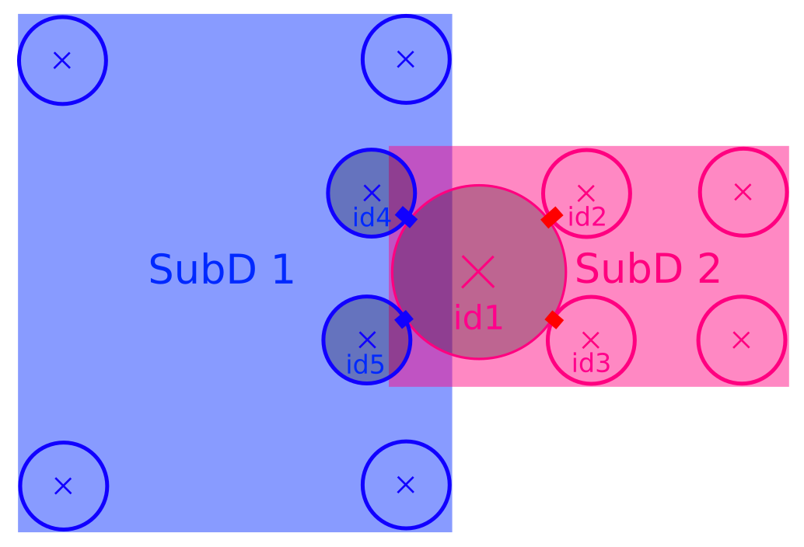

.. _mpy:

MPI parallelization
===================

The module :yref:`yade.mpy` implements parallelization by domain decomposition (distributed memory) using the Message Passing Interface (MPI) implemented by OpenMPI. It aims at exploiting large numbers of compute nodes by running independent instances of Yade on them.
The shared memory and the distributed memory approaches are compatible, i.e. it is possible to run hybrid jobs using both, and it may well be the optimal solution in some cases.

Most (initially *all*) calls to OpenMPI library are done in Python using `mpi4py <https://mpi4py.readthedocs.io>`_. However for the sake of efficiency some critical communications are triggered via python wrappers of C++ functions, wherein messages are produced, sent/received, and processed.

This module development was started in 2018. It received contributions during a `HPC hackathon <http://geomec.net/newsletter/?p=432>`_. An extension enables :ref:`parallel coupling with OpenFoam <FoamCouplingEngine>`.

.. note:: see also :yref:`reference documentation of the mpy <yade.mpy>` module.

.. note:: Disclaimer: even though the `yade.mpy` module provides the function :yref:`mpirun<yade.mpy.mpirun>`, which may seem as a simple replacement for `O.run()`, setting up a simulation with mpy might be deceptively triavial.
    As of now, it is anticipated that, in general, a simple replacement of "run" by "mpirun" in an arbitrary script will not speedup anything and may even fail miserably (it could be improved in the future). To understand why, and to tackle the problems, basic knowledge of how MPI works will certainly help (specifically `mpi4py <https://mpi4py.readthedocs.io>`_).

Concepts
________

**subdomain**: a (sub)set of bodies attached to one MPI process after domain decomposition - with or without spatial coherence. The corresponding class in Yade is :yref:`Subdomain`, a `Shape` instance with helper functions for MPI communications. In some sense `Subdomain` is to subscribed bodies what :yref:`Clump` (another `Shape`) is to clump members.

**rank**: subdomain index from 0 to *N*-1  (with *N* the number of mpi processes) to identify subdomains. The rank of the subdomain a body belongs to can be retrieved as :yref:`Body.subdomain`. Each subdomain corresponds to an instance of Yade and a specific scene during parallel execution. The rank of the scene is given by :yref:`Scene.subdomain`.

**master**: refers to subdomain with *rank* =0. This subdomain does not behave like others. In general master will handle boundary conditions and it will control transitions and termination of the whole simulation. Unlike standard subdomains it may not contain a large number of raw bodies (i.e. not beyond objects bounding the scene such as walls or boxes). In interactive execution master is the process responding to the python prompt.

**splitting and merging**: cutting a master :yref:`Scene` into a set of smaller, distributed, scenes is called "splitting". The split is undone by a 'merge', by which all bodies and (optionally) all interactions are sent back to the master thread. Splitting, running, then merging, should leave the scene as if no MPI had been used at all (i.e. as if the same number of iterations had been executed in single-thread). Therefore normal O.run() after that should work as usual.

**intersections**: subsets of bodies in a subdomain intersected by the bounding box of other subdomains (see `fig-subdomains`_). *intersection(i,j)* refers to the bodies owned by current (*i*) subdomain and intersecting subdomain *j* (retrieved as :yref:`O._sceneObj.subD.intersections[j]<Subdomain.intersections>`); *mirrorIntersection(i,j)* refers to bodies owned by *j* and intersecting current domain (retrieved as :yref:`O._sceneObj.subD.mirrorIntersections[j]<Subdomain.mirrorIntersections>`). The bodies are listed by :yref:`Body.id`. By definition *intersection(i,j)=mirrorIntersection(j,i)*.

The intersections and mirror intersections are updated automatically as part of parallel collision detection. They define which body states need to be communicated. The bodies in intersections need to be *sent* to other subdomains (in pratice only updated position and velocity are sent at every iteration), the bodies in mirrorIntersections need to be received from other subdomains.

.. _fig-subdomains:

Two overlapping subdomains and their intersections. In this situation we have *SubD1.intersections[SubD2.subdomain]=[id4,id5]* and *SubD1.mirrorIntersections[SubD2.subdomain]=[id1]*, with *SubD1* and *SubD2* instances of :yref:`Subdomain`.

.. _sect_mpi_implementation:

Walkthrough
___________

For demonstrating the main internal steps in the implemented parallel algorithm let us consider the example script :ysrc:`examples/mpi/testMPI_2D.py`. Executing this script (interactive or passive mode) with three MPI processes generates the scene as shown in `fig-scene-mpi`_. It then executes :yref:`mpirun<yade.mpy.mpirun>`, which triggers the steps described hereafter.

.. _fig-scene-mpi:
.. figure:: fig/mpyschema0.*
	:width: 30%
	:align: center

In this scene, we have three MPI processes (three subdomains) and the raw bodies are partitioned among the subdomains/ranks 1 and 2. The master process with subdomain=0 holds the boundary/wall type body. Bodies can be manually assigned or automatically assigned via a domain decomposition algorithm. Details 
on the dommain decomposition algorithm is presented in the later section of this document. 

**Scene splitting** :

In the function :yref:`yade.mpy.splitScene`, called at the beginning of mpi execution, specific engines are added silently to the scene in order to handle what will happen next. That very intrusive operation can even change settings of some pre-existing engines, in particular :yref:`InsertionSortCollider`, to make them behave with MPI-friendlyness. :yref:`InsertionSortCollider.verletDist` is an important factor controlling the efficiency of the simulations. The reason for this will become evident in the later steps. 

**Bounds dispatching** : In the next step, the :yref:`Body.bound` is dispatched with the :yref:`Aabb` extended as shown in figure `fig-regularbounds`_ (in dotted lines). Note that the :yref:`Subdomain` :yref:`Aabb` is obtained from taking the min and max of the owned bodies, see figure `fig-subDBounds`_  
with solid coloured lines for the subdomain :yref:`Aabb`. At this time, the min and max of other subdomains are unknown. 

.. _fig-regularbounds:
.. figure:: fig/mpyschema1a.*
	:width: 30%
	:align: center

.. _fig-subDBounds:
.. figure:: fig/mpyschema1b.*
	:width: 30%
	:align: center

**Update of Domain bounds** : Once the bounds for the regular bodies and the *local subdomain* has been dispatched, information on the other subdomain bounds are obtained via the function :yref:`yade.mpy.updateDomainBounds`. In this collective communication, each subdomain broadcasts 
its :yref:`Aabb.min` and :yref:`Aabb.max` to other subdomains. Figure `fig-subdomain-bounds`_  shows a schematic in which each subdomain has received the :yref:`Aabb.min` and :yref:`Aabb.max` of the other subdomains. 

.. _fig-subdomain-bounds:
.. figure:: fig/mpyschema2.*
    :width: 55%
    :align: center
    
**Parallel Collision detection** : 

- Once the  :yref:`Aabb.min` and :yref:`Aabb.max` of the other subdomains are obtained, the collision detection algorithm is used to determine the bodies that have intersections with the remote subdomains. The ids of the identified bodies are then used to build the :yref:`Subdomain.intersections` list. 

 .. _fig-schema-localIntersections:
 .. figure:: fig/mpyschema3.*
    :width: 55%
    :align: center

- Next step involves obtaining the ids of the remote bodies intersecting with the current subdomain (:yref:`Subdomain.mirrorIntersections`). Each subdomain sends its list of local body intersections to the respective remote subdomains and also receives the list of intersecting ids from the other subdomains. 
  If the remote bodies do not exist within the current subdomain's :yref:`BodyContainer`, the subdomain then *requests* these remote bodies from the respective subdomain.  A schematic of this operation is shown in figure `fig-mirrorIntersections`_, 
  in which subdomain=1 receives three bodies from subdomain=2, and 1 body from subdomain=0. subdomain=2 receives three bodies from subdomain=1. subdomain=0 only sends its bodies and does *not* receive from the worker subdomains. This operation sets the stage for communication of the body states to/from the other subdomains. 

 .. _fig-mirrorIntersections:
 .. figure:: fig/mpysendBodies.*
    :width: 55%
    :align: center

**Update states** :  

Once the subdomains and the associated intersecting bodies, and remote bodies are identified, :yref:`State` of these bodies are sent and received every timestep, by peer-to-peer communications between the interacting subdomains. In the case of an interaction with the master subdomain (subdomain=0), only the total force and torque exerted on master's bodies by a given subdomain are sent. Figure `fig-sendRecvStates`_ shows a schematic in which the states of the remote bodies between subdomain=1 and subdomain=2 are communicated. Subdomain=0 receives forces and torques from subdomain=1 and subdomain=2. 

.. _fig-sendRecvStates:
.. figure:: fig/mpyschema4.*
    :width: 55%
    :align: center

MPI initialization and communications
_____________________________________

The mpy modules tries to retain one of Yade's most important features: interactive access to the objects of scene (or of multiple scenes in this case), as explained below. Interactive execution does not use the `mpiexec` command of OpenMPI, instead, a pool of workers is spawned by the mpy module after Yade startup. In production one may use passive jobs, and in that case `mpiexec` will preceed the call to Yade.

.. note:: Most examples in this page use 4 mpi processes. It is not a problem, in principle, to run the examples even if the number of available cores is less than 4 (this is called oversubscribing (it may also fail depending on OS and MPI implementation). There is no performance gain to expect from oversubscribing but it is useful for experiments (e.g. for testing the examples in this page on a single-core machine).

Interactive mode
----------------
The interactive mode aims primarily at inspecting the simulation after some MPI execution for debugging. Functions shown here (especially `sendCommand`) may also be usefull in the general case, to achieve advanced tasks such as controlling transitions between phases of a simulation, collecting and processing results.

Explicit initialization from python prompt
^^^^^^^^^^^^^^^^^^^^^^^^^^^^^^^^^^^^^^^^^^

A pool of Yade instances can be spawned with mpy.initialize() as illustrated hereafter. Mind that the next sequences of commands are supposed to be typed directly in the python prompt after starting Yade, it will not give exactly the same result if it is pasted into a script executed by Yade (see the next section on automatic initialization):

.. .. ipython:: # avoid issues in gitlab for now
.. code-block:: python
	
	@suppress
	Yade [1]: from yade.utils import *
	
	@suppress
	Yade [1]: O.engines=yade.utils.defaultEngines

	Yade [2]: wallId=O.bodies.append(box(center=(0,0,0),extents=(2,0,1),fixed=True))

	Yade [3]: for x in range(-1,2):
	   ...:    O.bodies.append(sphere((x,0.5,0),0.5))
	   ...:

	Yade [5]: from yade import mpy as mp
	
	@suppress
	Yade [5]: mp.COLOR_OUTPUT=False
	
	@doctest
	Yade [6]: mp.initialize(4)
	Master: I will spawn  3  workers
	->  [6]: (0, 4)

After mp.initialize(np) the parent instance of Yade takes the role of master process (rank=0). It is the only one executing the commands typed directly in the prompt.
The other instances (rank=1 to rank=np-1) are idle and they wait for commands sent from master. Sending commands to the other instances can be done with `mpy.sendCommand()`, which by default returns the result or the list of results. We use that command below to verify that the spawned workers point to different (still empty) scenes:

.. note: the ipython directive works fine but the stdout from workers is not captured unfortunately
.. it appears mangled with sphinx output at build time instead, so we use verbatim to get correct display

.. .. ipython:: 

.. 	:verbatim:

.. code-block:: python

	Yade [8]: len(O.bodies)
	 ->  [8]: 4
	 
	Yade [10]: mp.sendCommand(executors="all",command="len(O.bodies)",wait=True) #check content
	->  [10]: [4, 0, 0, 0]
	
	Yade [9]: mp.sendCommand(executors="all",command="str(O)") # check scene pointers
	 ->  [9]: 
	['<yade.wrapper.Omega object at 0x7f9c0a399490>',
	'<yade.wrapper.Omega object at 0x7f9231213490>',
	'<yade.wrapper.Omega object at 0x7f20086a1490>',
	'<yade.wrapper.Omega object at 0x7f622b47f490>']

Sending commands makes it possible to manage all types of message passing using calls to the underlying mpi4py (see mpi4py documentation).
Be carefull with sendCommand "blocking" behavior by default. Next example would hang without "wait=False" since both master and worker would be waiting for a message from each other.

.. .. ipython::
.. 
.. 	:verbatim:
	
.. code-block:: python

	Yade [3]: mp.sendCommand(executors=1,command="message=comm.recv(source=0); print('received',message)",wait=False)

	Yade [4]: mp.comm.send("hello",dest=1)
	received hello

Every picklable python object (namely, nearly all Yade objects) can be transmitted this way. Remark hereafter the use of :yref:`mpy.mprint <yade.mpy.mprint>` (identifies the worker by number and by font colors). Note also that the commands passed via `sendCommand` are executed in the context of the mpy module, for this reason `comm`, `mprint`, `rank` and all objects of the module are accessed without the `mp.` prefix.

.. .. ipython::
.. 
.. 	:verbatim:
	
.. code-block:: python

	Yade [3]: mp.sendCommand(executors=1,command="O.bodies.append(comm.recv(source=0))",wait=False) # leaves the worker idle waiting for an argument to append()

	Yade [4]: b=Body(shape=Sphere(radius=0.7))  # now create body in the context of master

	Yade [5]: mp.comm.send(b,dest=1) # send it to worker 1

	Yade [6]: mp.sendCommand(executors="all",command="mprint('received',[b.shape.radius if hasattr(b.shape,'radius') else None for b in O.bodies])")
	Master: received [None, 0.5, 0.5, 0.5] 
	Worker1: received [0.7] 
	Worker3: received [] 
	Worker2: received [] 
	->  [5]: [None, None, None, None] # printing yields no return value, hence that empty list of returns, "wait=False" argument to sendCommand would suppress it

Explicit initialization from python script
^^^^^^^^^^^^^^^^^^^^^^^^^^^^^^^^^^^^^^^^^^

Though usefull for advanced operations, the function sendCommand() is limited. Basic features of the python language are missing, e.g. function definitions and loops are a problem - in fact every code fragment which can't fit on a single line is. In practice the mpy module provides a mechanism to initialize from a script, where functions and variables will be declared.

Whenever Yade is started with a script as an argument, the script name will be remembered, and if mpy.initialize() is called (by the script itself or interactively in the prompt), all Yade instances will be initialized with that same script. It makes distributing function definitions and simulation parameters trivial (and even distributing scene constructions as seen below).

This behaviour is what happens usually with MPI: all processes execute the same program. It is also what happens with "mpiexec -np N yade ...".

If the first commands above are pasted into a script used to start Yade, all workers insert the same bodies as master (with interactive execution only master was inserting). Here is the script::

	# script 'test1.py'
	wallId=O.bodies.append(box(center=(0,0,0),extents=(2,0,1),fixed=True))
	for x in range(-1,2):
		O.bodies.append(sphere((x,0.5,0),0.5))
	from yade import mpy as mp
	mp.initialize(4)
	print( mp.sendCommand(executors="all",command="str(O)",wait=True) )
	print( mp.sendCommand(executors="all",command="len(O.bodies)",wait=True) )

and the output reads:

.. .. ipython::
.. 
.. 	:verbatim:

.. code-block:: python

	yade test1.py 
	...
	Running script test1.py
	Master: will spawn  3  workers 
	None
	None
	None
	None
	None
	None
	['<yade.wrapper.Omega object at 0x7feb979403a0>', '<yade.wrapper.Omega object at 0x7f5b61ae9440>', '<yade.wrapper.Omega object at 0x7fdd466b8440>', '<yade.wrapper.Omega object at 0x7f8dc7b73440>']
	[4, 4, 4, 4]

That's because all instances execute the script in the initialize() phase. "None" is printed 2x3 times because the script contains `print( mp.sendCommand(...))` twice, the workers try to execute that too, but for them `sendCommand` returns by default, hence the None.

Though logical, this result is not what we want if we try to split a simulation into pieces. The solution (typical of all mpi programs) is to use the `rank` of the process in conditionals. Different parts of the script can then be executed, differently, by each worker, depending on its rank. In order to produce the same result as before, for instance, the script can be modified as follows::

	# script 'test2.py'
	from yade import mpy as mp
	mp.initialize(4)
	if mp.rank==0: # only master
		wallId=O.bodies.append(box(center=(0,0,0),extents=(2,0,1),fixed=True))
		for x in range(-1,2):
		O.bodies.append(sphere((x,0.5,0),0.5))

		print( mp.sendCommand(executors="all",command="str(O)",wait=True) )
		print( mp.sendCommand(executors="all",command="len(O.bodies)",wait=True) )
		print( mp.sendCommand(executors="all",command="str(O)",wait=True) )
		
Resulting in::

	Running script test2.py
	Master: will spawn  3  workers 
	['<yade.wrapper.Omega object at 0x7f21a8c8d3a0>', '<yade.wrapper.Omega object at 0x7f3142e43440>', '<yade.wrapper.Omega object at 0x7fb699b1a440>', '<yade.wrapper.Omega object at 0x7f1e4231e440>']
	[4, 0, 0, 0]

We could also use `rank` to assign bodies from different regions of space to different workers, as found in example :ysrc:`examples/mpi/helloMPI.py`, with rank-dependent positions::

	# rank is accessed without "mp." prefix as it is interpreted in mpy module's scope
	mp.sendCommand(executors=[1,2],command= "ids=O.bodies.append([sphere((xx,1.5+rank,0),0.5) for xx in range(-1,2)])")
	
Keep in mind that the position of the call *mp.initialize(N)* relative to the other commands has no consequence for the execution by the workers (for them initialize() just returns), hence program logic should not rely on it. The workers execute the script from begin to end with the same MPI context, already set when the first line is executed. It can lead to counter intuitive behavior, here is a script::

	# testInit.py
	# script.py
	O.bodies.append([Body() for i in range(100)])

	from yade import mpy as mp
	mp.mprint("before initialize: rank ", mp.rank,"/", mp.numThreads,"; ",len(O.bodies)," bodies")
	mp.initialize(2)
	mp.mprint("after initialize: rank ", mp.rank,"/", mp.numThreads,"; ",len(O.bodies)," bodies")

and the output:
	
.. .. ipython::
.. 
.. 	:verbatim:
	
.. code-block:: python
	
	Running script testInit.py
	Master: before initialize: rank  0 / 1 ;  100  bodies 
	Master: will spawn  1  workers 
	Master: after initialize: rank  0 / 2 ;  100  bodies 
	Worker1: before initialize: rank  1 / 2 ;  100  bodies 
	Worker1: after initialize: rank  1 / 2 ;  100  bodies 

mpirun (automatic initialization)
^^^^^^^^^^^^^^^^^^^^^^^^^^^^^^^^^

Effectively running a distributed DEM simulation on the basis of the previously described commands would be tedious. The mpy module thus provides the function :yref:`mpy.mpirun <yade.mpy.mpirun>` to automate most of the steps, as described in :ref:`introduction <sect_mpi_implementation>`. Mainly, splitting the scene into subdomains based on rank assigned to bodies and handling collisions between the subdomains as time integration proceeds (includes changing the engine list agressively to make this all happen).

If needed, the first execution of mpirun will call the function initialize(), which can therefore be omitted on the user's side.
The subdomains will be merged into a centralized scene on the master process at the end of the iterations depending on the argument *withMerge*. 

Here is a concrete example where a floor is assigned to master and multiple groups of spheres are assigned to subdomains::

	import os
	from yade import mpy as mp
	
	NSTEPS=5000 #turn it >0 to see time iterations, else only initilization 
	numThreads = 4 # number of threads to be spawned, (in interactive mode).

	#materials 
	young = 5e6
	compFricDegree = 0.0
	O.materials.append(FrictMat(young=young, poisson=0.5, frictionAngle = radians(compFricDegree), density= 2600, label='sphereMat'))
	O.materials.append(FrictMat(young=young*100, poisson = 0.5, frictionAngle = compFricDegree, density =2600, label='wallMat'))

	#add spheres
	
	mn,mx=Vector3(0,0,0),Vector3(90,180,90)
	pred = pack.inAlignedBox(mn,mx)
	O.bodies.append(pack.regularHexa(pred,radius=2.80,gap=0, material='sphereMat'))

	#walls (floor)
	
	wallIds=aabbWalls([Vector3(-360,-1,-360),Vector3(360,360,360)],thickness=10.0, material='wallMat')
	O.bodies.append(wallIds)

	#engines 
	O.engines=[
		ForceResetter(),
		InsertionSortCollider([
			Bo1_Sphere_Aabb(),
			Bo1_Box_Aabb()], label = 'collider'), # always add labels. 
		InteractionLoop(
			[Ig2_Sphere_Sphere_ScGeom(),Ig2_Box_Sphere_ScGeom()],
			[Ip2_FrictMat_FrictMat_FrictPhys()],
			[Law2_ScGeom_FrictPhys_CundallStrack()], 
			label="interactionLoop"
		),
		GlobalStiffnessTimeStepper(timestepSafetyCoefficient=0.3,  timeStepUpdateInterval=100, parallelMode=True, label = 'timeStepper'),
		NewtonIntegrator(damping=0.1,gravity = (0, -0.1, 0), label='newton'), 
		VTKRecorder(fileName='spheres/3d-vtk-', recorders=['spheres', 'intr', 'boxes'], parallelMode=True,iterPeriod=500), #use .pvtu to open spheres, .pvtp for ints, and .vtu for boxes.
	]

	#set a custom verletDist for efficiency. 
	collider.verletDist = 1.5

	#########  RUN  ##########
	# customize mpy
	mp.ERASE_REMOTE_MASTER = True   #keep remote bodies in master? 
	mp.DOMAIN_DECOMPOSITION= True	#automatic splitting/domain decomposition
	#mp.mpirun(NSTEPS)		#passive mode run 
	mp.MERGE_W_INTERACTIONS = False
	mp.mpirun(NSTEPS,numThreads,withMerge=True) # interactive run, numThreads is the number of workers to be initialized, see below for withMerge explanation.
	mp.mergeScene()  #merge scene after run. 
	if mp.rank == 0: O.save('mergedScene.yade')

	#demonstrate getting stuff from workers, here we get kinetic energy from worker subdomains, notice that the master (mp.rank = 0), uses the sendCommand to tell workers to compute kineticEnergy. 
	if mp.rank==0:
		print("kinetic energy from workers: "+str(mp.sendCommand([1,2],"kineticEnergy()",True)))
		

The script is then executed::

	yade script.py 

For running further timesteps, the mp.mpirun command has to be executed in yade prompt::
	
	Yade [0]: mp.mpirun(100,4,withMerge=False) #run for 100 steps and no scene merge. 
	
	Yade [1]: mp.sendCommand([1,2],"kineticEnergy()",True) # get kineticEnergy from workers 1 and 2. 
	
	Yade [2]: mp.mpirun(1,4,withMerge=True) # run for 1 step and merge scene into master. Repeat multiple time to watch evolution in QGL view
	

Non-interactive execution
-------------------------

Instead of spawning mpi processes after starting Yade, it is possible to run Yade with the classical "mpiexec" from OpenMPI. Importantly, it may be the only method allowed through HPC job submission systems. When using mpiexec there is no interactive shell, or a broken one (which is ok in general in production). The job needs to run (or "`mpirun`") and terminate by itself.

The functions `initialize` and `mpirun` described above handle both interactive and passive executions transparently, and the user scripts should behave the same in both cases.
"Should", since what happens behind the scenes is not exactly the same at startup, and it may surface in some occasions (let us know).

Provided that a script calls :yref:`yade.mpy.mpirun` with a number of timesteps, the simulation (see e.g. :ysrc:`examples/mpi/vtkRecorderExample.py`) is executed with the following command::

	mpiexec -np NUMSUBD+1 yade vtkRecorderExample.py 

where *NUMSUBD* corresponds to the required number of subdomains.

.. note:: Remember that the master process counts one while it does not handle an ordinary subdomain, therefore the number of processes is always *NUMSUBD* +1.
	

Splitting
_________

Splitting an initial scene into subdomains and updating the subdomains after particle motion are two critical issues in terms of efficiency.
The decomposition can be prescribed on users's side (first section below), but mpy module also provides algorithms for both.

.. note:: The mpy module has no requirement in terms of how the subdomains are defined, and using the helper functions described here is not a requirement. Even assigning the bodies randomly from a large cloud to a number of subdomains (such that the subdomains overlap each other and the scene entirely) would work. It would only be suboptimal as the number of interactions between subdomains would increase compared to a proper partition of space. 

Split by yourself
-----------------

In order to impose a decomposition it is enough to assign :yref:`Body.subdomain` a value corresponding to the process rank it should belong to. This can be done either in one centralized scene that is later split, or by inserting the correct subsets of bodies independently in each subdomain (see section on `scene construction <sect_mpi_construction>`_)

In the example script :ysrc:`examples/mpi/testMPI_2D.py` the spheres are generated as follows (centralized construction in this example, easily turned into distributed one). For each available worker a bloc of spheres is generated with a different position in space. The spheres in each block are assigned a subdomain rank (and a color for visualisation) so that they will be picked up by the right worker after mpirun().::

	for sd in range(0,numThreads-1):
		col = next(colorScale)
		ids=[]
		for i in range(N):#(numThreads-1) x N x M spheres, one thread is for master and will keep only the wall, others handle spheres
			for j in range(M):
				id = O.bodies.append(sphere((sd*N+i+j/30.,j,0),0.500,color=col)) #a small shift in x-positions of the rows to break symmetry
				ids.append(id)
			for id in ids: O.bodies[id].subdomain = sd+1

Don't know how to split? Leave it to mpirun
-------------------------------------------

Initial split
^^^^^^^^^^^^^
 mpirun will decide by itself how to distribute the bodies across several subdomains if *DOMAIN_DECOMPOSITION* =True. In such case the difference between the sequential script and its mpi version is limited to importing mpy and calling mpirun after turning the *DOMAIN_DECOMPOSITION* flag.  
 
 The automatic splitting of bodies to subdomains is based on the Orthogonal Recursive Bisection Algortithm of Berger [Berger1987]_, and [Fleissner2007]_. The partitioning is based on bisecting the space at several *levels*, with the longest axis in each level chosen as 
 the bisection axis. The number of levels is determined as :math:`int(log_{2}(N_{w}))` with :math:`N_{w}` being the number of worker subdomains. A schematic of this decomposition is shown in `fig-bisectionAlgo`_, with 4 worker subdomains. At the initial stage (level = 0),  we assume 
 that subdomain=1 contains the information of the body positions (and bodies), the longest axis is first determined, this forms the bisectioning axis/plane. The list containing the body positions is sorted along the bisection axis, and the median of this sorted list is determined. The bodies with positions (bisection coordinate) less than the median is coloured with the current subdomain, (SD=1) and the other half is coloured with 
 SD = 2, the subdomain colouring at each level is determined using the following rule::
      
      if (subdomain <  1<<level) : this subdomain gets the bodies with position lower than the median. 
      if ((subdomain >  1<<level) and (subdomain <  1<<(level+1) ) ) : this subdomain gets the bodies with position greater than median, from subdomain - (1<<level) 
      
     
 This process is continued until the number of levels are reached.
   
 .. _fig-bisectionAlgo:
 .. figure:: fig/mpyrecursuveBisection.*
    :width: 35%
    :align: center

 Figure `fig-domainDecompose`_ shows the resulting partitioning obtained using the ORB algorithm : (a) for 4 subdomains, (b) for 8 subdomains. Odd number of worker subdomains are also supported with the present implementation.
 
 .. _fig-domainDecompose:
 .. figure:: fig/mpyddcmp.*
    :width: 55%
    :align: center

 The present implementation can be found in :ysrc:`py/bisectionDecomposition.py`, and a parallel version can be found `here. <https://github.com/bchareyre/yade-mpi/blob/593a4d6abf7e488ab1ac633a1e6725ac301b2a14/py/tree_decomp.py>`_

.. note:: importing :ysrc:`py/bisectionDecomposition.py` triggers the import of *mpi4py* and ultimately of the MPI library and related environment variables. The *mpy* module may change some mpi settings on import, therefore it is safer to only import *bisectionDecomposition* after some ``mpy.initialize()``.

 
Updating the decomposition (load balancing)
^^^^^^^^^^^^^^^^^^^^^^^^^^^^^^^^^^^^^^^^^^^

As the bodies move, each subdomain may experience overall distortion and diffusion of bodies leading to an undesirable overlap between multiple subdomains. This subdomain overlap introduces inefficiencies in communications between MPI workers, and thus we aim to keep the subdomains as compact as possible by using an algorithm that dynamically reallocates bodies to new subdomains with an objective of minimizing MPI communications. The algorithm exploits :yref:`InsertionSortCollider` to reassign bodies efficiently and in synchronicity with collision detection, and it can be activated if :yref:`mpy.REALLOCATE_FREQUENCY <yade.mpy.REALLOCATE_FREQUENCY>`>0.

The algorithm is *not* centralized, which preserves scalability. Additionally, it only engages peer-to-peer communications between MPI workers that share an intersection. The re-assignment depends on a filter for making local decisions. At the moment, there is one filter available called :yref:`mpy.medianFilter`. Custom filters can be used instead.

The median filter body re-allocation criterion criterion involves finding the position of a median plane between two subdomains such that after discriminating bodies on the "+" and "-" side of that plane the total number in each subdomain is preserved. It results in the type of split shown in the video hereafter. Even though the median planes seem to rotate rather quickly at some point in this video, there are actually five collision detections between each re-allocation, i.e. thousands of time iterations to effectively rotate the split between two different colors. These progressive rotations are beneficial since the initial split would have resulted in flat discs otherwise.

.. youtube:: Qb5vPjRPFRw

.. note::  This is not a load balancing in the sense of achieving an equal amount of work per core. In fact that sort of balancing is achieved by definition already as soon as each worker is assigned the same amount of bodies (and because a subdomain is really ultimately a list of bodies, not a specific region of space). Instead the objective is to decrease the communication times overall.

.. _sect_mpi_construction:

Centralized versus distributed scene construction
-------------------------------------------------

For the centralized scene construction method, the master process creates all of the bodies of a scene and assigns subdomains to them. As part of mpy initialization some engines will be modified or inserted, then the scene is broadcasted to the workers.
Each worker receives the entire scene, identifies its assigned bodies via :yref:`Body.subdomain` (if worker's :code:`rank==b.subdomain` the bodies are retained) and erase the others. Such a scene construction was used in the previous example and it is by far the simplest. It makes no real difference with building a scene for non-MPI execution besides calling `mp.mpirun` instead or just `O.run`.

For large number of bodies and processes, though, the centralized scene construction and distribution can consume a significant amount of time. It can also be memory bound since the memory usage is quadratic: suppose N bodies per thread on a 32-core node, centralized construction implies that 32 copies of the entire scene exist simultaneously in memory at some point in time (during the split), i.e. :math:`32^2 N` bodies on one single node. For massively parallel applications distributed construction should be prefered.

In distributed mode each worker instantiates its own bodies and insert them in the local :yref:`BodyContainer`. Attention need to be paid to properly assign bodies ids since no index should be owned by two different workers initially. Insertion of bodies  in :yref:`BodyContainer` with imposed ids is done with 
:yref:`BodyContainer.insertAtId`. The distributed mode is activated by setting the :code:`DISTRIBUTED_INSERT` flag ON, the user is in charge of setting up the subdomains and partitioning the bodies. An example of distributed insertion can be found in :ysrc:`examples/mpi/parallelBodyInsert3D.py`. 

The relevant fragment, where the filtering is done by skipping all steps of a loop except the one with proper rank (keep in mind that all workers will run the same loop but they all have a different rank each), reads::

	#add spheres
	subdNo=0
	import itertools
	_id = 0 #will be used to count total number of bodies regardless of subdomain attribute, so that same ids are not reused for different bodies
	for x,y,z in itertools.product(range(int(Nx)),range(int(Ny)),range(int(Nz))):
		subdNo+=1
		if mp.rank!=subdNo: continue
		ids=[]
		for i in range(L):#(numThreads-1) x N x M x L spheres, one thread is for master and will keep only the wall, others handle spheres
			for j in range(M):
				for k in range(N):
					dxOndy = 1/5.; dzOndy=1/15.  # shifts in x/y-positions to make columns inclines
					px= x*L+i+j*dxOndy; pz= z*N+k+j*dzOndy; py = (y*M+j)*(1 -dxOndy**2 -dzOndy**2)**0.5 #so they are always nearly touching initialy
					id = O.bodies.insertAtId(sphere((px,py,pz),0.500),_id+(N*M*L*(subdNo-1)))
					_id+=1
					ids.append(id)
		for id in ids: O.bodies[id].subdomain = subdNo
		
	if mp.rank==0: #the wall belongs to master
		WALL_ID=O.bodies.insertAtId(box(center=(Nx*L/2,-0.5,Nz*N/2),extents=(2*Nx*L,0,2*Nz*N),fixed=True),(N*M*L*(numThreads-1)))

The bissection algorithm can be used for defining the initial split, in the distributed case too, since it takes a points dataset as input. Provided that all workers work with the same dataset (e.g. the same sequence of a random number generator) they will all reach the same partitioning, and they can instantiate their bodies on this basis. 

Merging
_______

The possibility of a "merge", shown in the previous example, can be performed using an optional argument of `mpirun` or as a standalone function :yref:`mpy.mergeScene <yade.mpy.mergeScene>`. 

If withMerge=True in mpirun then the bodies in master scene are updated to reflect the evolution of their distributed clones. This is done once after finishing the required number of iterations in mpirun. This *merge* operation can include updating interactions. :yref:`mpy.mergeScene <yade.mpy.mergeScene>` does the same within the current iteration.
Merging is an expensive task which requires the communication of large messages and, therefore, it should be done purposely and at a reasonable frequency. It can even be the main bottleneck for massively parallel scenes. Nevertheless, it can be useful for debugging with the 3D view, or for various post-processing tasks. 
The *MERGE_W_INTERACTIONS* provides a full merge, i.e. the interactions in the worker subdomains and between the subdomains are included, otherwise, only the position and states of the bodies are used. Merging with interactions should result in a usual Yade scene, ready for further time-stepping in non-mpi mode or (more useful) for some post-processing. The merge operation is not required for a proper time integration in general.

Hints and problems to expect
____________________________

MPI support in engines
----------------------

For MPI cases, the *parallelMode* flag for :yref:`GlobalStiffnessTimeStepper` and :yref:`VTKRecorder` have to be turned on. They are the only two engines upgraded with MPI support at the moment.

For other things. Read next section and be careful. If you feel like implementing MPI support for other engines, that would be great, consider using the two available examples as guides. Let us know!

.. _sect_mpi_reduction:

Reduction (partial sums)
------------------------

Quantities such as kinetic energy cannot be obtained for the entire scene just by summing the return value of `kineticEnergy()` from each subdomain.
This is because each subdmomain may contain also images of bodies from intersecting subdomains and they may add their velocity, mass, or whatever is summed, to what is returned by each worker.
Although some most-used functions of Yade may progressively get mpi support to filter out bodies from remote domains, it is not standard yet and therefore partial sums may need to be implemented on a case-by-case basis, with proper filtering in the user script.

This is just an example of why many things may go wrong if `run` is directly replaced by `mpirun` in a complex script.

Miscellaneous
-------------

- sendCommand() has a hardcoded latency of 0.001s to not keep all cores 100\% busy waiting for a command (with possibly little left to OS). If sendCommand() is used at high frequency in complex algorithms it might be beneficial to decrease that sleep time.

Control variables
_________________

 - VERBOSE_OUTPUT : Details on each *operation/step* (such as :yref:`yade.mpy.splitScene`, :yref:`yade.mpy.parallelCollide` etc) is printed on the console, useful for debugging purposes
 - ACCUMULATE_FORCES : Control force summation on bodies owned by the master. 
 - ERASE_REMOTE_MASTER : Erase remote bodies in the master subdomain or keep them as unbounded ? Useful for fast merge.
 - OPTIMIZE_COM, USE_CPP_MPI : Use optimized communication functions and MPI functions from :yref:`Subdomain` class 
 - YADE_TIMING : Report timing statistics, prints time spent in communications, collision detection and other operations. 
 - DISTRIBUTED_INSERT : Bodies are created and inserted by each subdomain, used for distributed scene construction. 
 - DOMAIN_DECOMPOSITION : If true, the bisection decomposition algorithm is used to assign bodies to the workers/subdomains. 
 - MINIMAL_INTERSECTIONS : Reduces the size of position/velocity communications (at the end of the colliding phase, we can exclude those bodies with no interactions besides body<->subdomain from intersections). 
 - REALLOCATE_FREQUENCY : if > 0, bodies are migrated between subdomains for efficient load balancing. If =1 realloc. happens each time collider is triggered, else every N collision detection
 - REALLOCATE_MINIMAL : Intersections are minimized before reallocations, hence minimizing the number of reallocated bodies
 - USE_CPP_REALLOC : Use optimized C++ functions to perform body reallocations
 - FLUID_COUPLING : Flag for coupling with OpenFOAM. 
 

Benchmark
_________

.. _fig-mpy-benchmark:
.. figure:: fig/mpybenchmarkDahu.*
    :width: 55%
    :align: center

Comments:

* From 1k particles/core to 8k particles/core there is a clear improvement. Obviously 1k is too small and most of the time is spent in comunications.
* From 8k/core to 64k/core the throughput per core is more or less the same, and the performance is not too far from linear. The data includes elimination of random noise, and overall it is not clear to me which non-linearity comes from the code and which one comes from the hardware.
* Conclusion, if you don't have at least 8k spheres/core (maybe less for more compex shapes) mpi is not your friend. This in line with the estimate of 10k by Dion Weatherley (DEM8+beer)
* It looks like OpenMP sucks, but be aware that the benchmark script is heavily tuned for MPI. It includes huges verletDist and more time wasted on virtual interactions to minimize global updates.
* I believe tuning for OpenMP could make -j26 (or maybe 2xMPIx -j13) on par or faster than 26 MPI threads for less than a million particle. Given the additional difficulty, MPI's niche is for more than a million particles or more than one compute node.
* the nominal per-core throughput is not impressive. On an efficient script my laptop can approach 1e6Cu while we get 0.3e6Cu per core on Dahu. MPI is not to blame here, my laptop would also outperform Dahu on a single core. 
