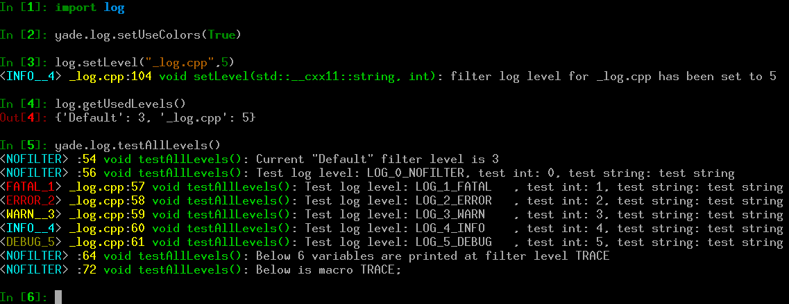

**********************
Programmer's manual
**********************

Build system
=============

Yade uses `cmake <http://www.cmake.org/>`__ the cross-platform, open-source build
system for managing the build process. It takes care of configuration, compilation
and installation. CMake is used to control the software compilation process using
simple platform and compiler independent configuration files. CMake generates
native makefiles and workspaces that can be used in the compiler environment of
your choice.


Building
-------------

Yade source tree has the following structure (omitting, ``doc``,
``examples`` and ``scripts`` which don't participate in the build process);
we shall call each top-level component *module*::

	core/         ## core simulation building blocks
	extra/        ## miscillanea
	gui/          ## user interfaces
	   qt4/          ## graphical user interface based on qt3 and OpenGL
	   qt5/          ## same, but for qt5
	lib/          ## support libraries, not specific to simulations
	pkg/          ## simulation-specific files
	   common/       ## generally useful classes
	   dem/          ## classes for Discrete Element Method
	py/           ## python modules

.. FIXME: what about /pkg/lbm i /pkg/pvf - put them here?


Header installation
^^^^^^^^^^^^^^^^^^^^
CMAKE uses the original source layout and it is advised to use ``#include <module/Class.hpp>``
style of inclusion rather than ``#include "Class.hpp`` even if you are in the same directory.
The following table gives a few examples:

============================================================= =========================
Original header location                                      Included as     
============================================================= =========================
``core/Scene.hpp``                                            ``#include <core/Scene.hpp>``
``lib/base/Logging.hpp``                                      ``#include <lib/base/Logging.hpp>``
``lib/serialization/Serializable.hpp``                        ``#include <lib/serialization/Serializable.hpp>``
``pkg/dem/SpherePack.hpp``                                    ``#include <pkg/dem/SpherePack.hpp>``
============================================================= =========================


Automatic compilation
""""""""""""""""""""""

In the ``pkg/`` directory, situation is different. In order to maximally ease 
addition of modules to yade, all ``*.cpp`` files are *automatically scanned* by 
CMAKE and considered for compilation.

.. FIXME: replace this with info about cmake -DENABLE_Something for #ifdef. Or something ilke that.

Each file may contain multiple lines that 
declare features that are necessary for this file to be compiled::

	YADE_REQUIRE_FEATURE(vtk);
	YADE_REQUIRE_FEATURE(gts);

This file will be compiled only if *both* ``VTK`` and ``GTS`` features are enabled. 
Depending on current feature set, only selection of plugins will be compiled.

It is possible to disable compilation of a file by requiring any non-existent feature, such as::

	YADE_REQUIRE_FEATURE(temporarily disabled 345uiysdijkn);

The ``YADE_REQUIRE_FEATURE`` macro expands to nothing during actual compilation.

.. _linking:

Linking
^^^^^^^^
The order in which modules might depend on each other is given as follows:

=========== ================================== ==============================================
module      resulting shared library           dependencies
=========== ================================== ==============================================
lib         ``libyade-support.so``             can depend on external libraries, may **not** depend on any other part of Yade.
core        ``libcore.so``                     ``yade-support``; *may* depend on external libraries.
pkg         ``libplugins.so``                  ``core``, ``yade-support``

gui         ``libQtGUI.so``,                   ``lib``, ``core``, ``pkg``
            ``libPythonUI.so``
py          (many files)                       ``lib``, ``core``, ``pkg``, external
=========== ================================== ==============================================


Development tools
=================

Integrated Development Environment and other tools
---------------------------------------------------
A frequently used IDE is Kdevelop. We recommend using this software for navigating 
in the sources, compiling and debugging. Other useful tools for debugging and 
profiling are Valgrind and KCachegrind. A series of wiki pages is dedicated to 
these tools in the `development section <https://yade-dem.org/wiki/Yade#Development>`__ of the wiki.

Hosting and versioning
----------------------
The Yade project is kindly hosted at `Launchpad <https://launchpad.net/yade/>`__
and `GitLab <https://gitlab.com/yade-dev/>`__:

.. comment Old Version:   which is used for source code, bug tracking, planning, package downloads and more. 

* `source code on gitlab <https://gitlab.com/yade-dev/trunk>`__
* `issue and bug tracking on gitlab <https://gitlab.com/yade-dev/trunk/issues>`__
* `package downloads on launchpad <https://launchpad.net/yade/+download>`__
* `yade-dev mailing list on launchpad <https://launchpad.net/~yade-dev>`__: yade-users@lists.launchpad.net
* `yade-users mailing list on launchpad <https://launchpad.net/~yade-users>`__: yade-users@lists.launchpad.net
* `questions and answers on launchpad <https://answers.launchpad.net/yade/>`__

The versioning software used is `GIT <http://git-scm.com/>`__, for which a short
tutorial can be found in :ref:`yade-gitrepo-label`.
GIT is a distributed revision control system. It is available packaged for all major linux distributions.

The `suorce code <https://gitlab.com/yade-dev/>`__ is periodically
imported to Launchpad for building PPA-packages.
The repository `can be http-browsed <https://gitlab.com/yade-dev/trunk>`__.

Build robot
-----------
A build robot hosted at `UMS Gricad <https://gricad-gitlab.univ-grenoble-alpes.fr/>`__
is tracking source code changes via `gitlab pipeline mechanism <https://gitlab.com/yade-dev/trunk/pipelines>`__.
Each time a change in the source code is committed to the main development branch via GIT,
or a `Merge Request (MR) <https://gitlab.com/yade-dev/trunk/merge_requests>`__ is submitted
the "buildbot" downloads and compiles the new version, and then starts a series of tests.

If a compilation error has been introduced, it will be notified to the yade-dev
mailing list and to the committer, thus helping to fix problems quickly.
If the compilation is successful, the buildbot starts unit regression tests and
"check tests" (see below) and report the results. If all tests are passed, a new
version of the documentation is generated and uploaded to the website in
`html <https://www.yade-dem.org/doc/>`__ and `pdf <https://yade-dem.org/doc/Yade.pdf>`__
formats. As a consequence, those two links always point to the documentation
(the one you are reading now) of the last successful build, and the delay between
commits and documentation updates are very short (minutes).
The buildbot activity and logs can be `browsed online <https://gitlab.com/yade-dev/trunk/-/jobs>`__.

The output of each particular build is directly accessible by clicking the green `"Passed" button <https://gitlab.com/yade-dev/trunk/-/jobs>`__,
and then clicking "Browse" in the "Job Artifacts" on the right.

.. _debugging:

Debugging
================

.. todo : ✓write about debug symbols, ✓yade-dbgsym package, ✓enabling debug builds, ✓ptrace permission problems in newer linux kernels, and a few more yade specific debug stuff.

For yade debugging two tools are available:

1. Use the debug build so that the stack trace provides complete information about potential crash. This can be achieved in two ways:

	a) Compiling yade with cmake option ``-DDEBUG=ON``,
	b) Installing ``yade-dbgsym`` debian/ubuntu package (this option will be available after `this task <https://gitlab.com/yade-dev/trunk/issues/58>`_ is completed).

2. Use :ref:`logging` framework described below.

These tools can be used in conjunction with other software. A detailed discussion of these is on `yade <https://yade-dem.org/wiki/Introduction_to_debugging>`_ `wiki <https://yade-dem.org/wiki/Debugging_using_Kdevelop>`_. These tools include: `kdevelop <https://www.kdevelop.org/>`_, `valgrind <http://valgrind.org/>`_, `alleyoop <http://alleyoop.sourceforge.net/>`_, `kcachegrind <http://kcachegrind.sourceforge.net/html/Home.html>`_, `ddd <http://www.gnu.org/software/ddd/>`_, `gdb <https://www.gnu.org/software/gdb/>`_, `kompare <https://en.wikipedia.org/wiki/Kompare>`_, `kdiff3 <http://kdiff3.sourceforge.net/>`_, `meld <https://meldmerge.org/>`_.

.. note:: On some linux systems stack trace will not be shown and a message ``ptrace: Operation not permitted`` will appear instead. To enable stack trace issue command: ``sudo echo 0 > /proc/sys/kernel/yama/ptrace_scope``. To disable stack trace issue command ``sudo echo 1 > /proc/sys/kernel/yama/ptrace_scope``.

.. hint:: When debugging make sure there is enough free space in /tmp.

.. _logging:

Logging
----------------

.. comment: https://www.boost.org/doc/libs/1_70_0/libs/log/doc/html/log/defs.html
	    https://dzone.com/articles/logging-levels-what-they-are-and-how-they-help-you
	    https://stackoverflow.com/questions/312378/debug-levels-when-writing-an-application
	    https://www.tutorialspoint.com/log4j/log4j_logging_levels.htm


Yade uses `boost::log <https://www.boost.org/doc/libs/release/libs/log/>`_ library for flexible logging levels and per-class debugging.
See also description of :yref:`yade.log module<yade.log>`.
A cmake compilation option ``-DENABLE_LOGGER=ON`` must be supplied during compilation [#flogcerr]_.

.. _imgLogging:


Figure imgLogging_ shows example use of logging framework. Usually a ``ClassName`` appears in place of ``_log.cpp`` shown on the screenshot. It is there because the ``yade.log`` module uses ``CREATE_CPP_LOCAL_LOGGER`` macro instead of the regular ``DECLARE_LOGGER`` and ``CREATE_LOGGER``, which are :ref:`discussed below <debug-macros>`.

.. note::
	Default format of log message is:

	.. code-block:: python

		<severity level> ClassName:LineNumber FunctionName: Log Message
	
	special macro ``LOG_NOFILTER`` is printed without ``ClassName`` because it lacks one.

Config files can be saved and loaded via :yref:`readConfigFile<yade._log.readConfigFile>` and :yref:`saveConfigFile<yade._log.saveConfigFile>`. The :yref:`defaultConfigFileName<yade._log.defaultConfigFileName>` is read upon startup if it exists. The filter level setting ``-f`` supplied from command line will override the setting in config file.


.. [#flogcerr] Without ``-DENABLE_LOGGER=ON`` cmake option the debug macros in :ysrc:`/lib/base/Logging.hpp` use regular ``std::cerr`` for output, per-class logging and log levels do not work.

.. _log-levels:

Log levels
^^^^^^^^^^^^^^^^

Following debug levels are supported:

.. table:: Yade logging verbosity levels.
	:widths: 17,18,8,57

	+------------------+--------------------+---------+---------------------------------------------------------------------------------+
	| macro name       | filter name        | option  | explanation                                                                     |
	+==================+====================+=========+=================================================================================+
	| ``LOG_NOFILTER`` | ``log.NOFILTER``   | ``-f0`` | Will print only the unfiltered messages. The LOG_NOFILTER macro is for          |
	|                  |                    |         | developer use only, so basically ``-f0`` means that nothing will be printed.    |
	|                  |                    |         | This log level is not useful unless a very silent mode is necessary.            |
	+------------------+--------------------+---------+---------------------------------------------------------------------------------+
	| ``LOG_FATAL``    | ``log.FATAL``      | ``-f1`` | Will print only critical errors. Even a throw to yade python                    |
	|                  |                    |         | interface will not recover from this situation.                                 |
	|                  |                    |         | This is usually followed by yade exiting to shell.                              |
	+------------------+--------------------+---------+---------------------------------------------------------------------------------+
	| ``LOG_ERROR``    | ``log.ERROR``      | ``-f2`` | Will also print errors which do not require to throw to yade python interface.  |
	|                  |                    |         | Calculations will continue, but very likely the results will be all wrong.      |
	+------------------+--------------------+---------+---------------------------------------------------------------------------------+
	| ``LOG_WARN``     | ``log.WARN``       | ``-f3`` | Will also print warnings about recoverable problems that you should be notified |
	|                  |                    |         | about (e.g., invalid value in a configuration file, so yade fell back to the    |
	|                  |                    |         | default value).                                                                 |
	+------------------+--------------------+---------+---------------------------------------------------------------------------------+
	| ``LOG_INFO``     | ``log.INFO``       | ``-f4`` | Will also print all informational messages (e.g. something was loaded,          |
	|                  |                    |         | something was called, etc.).                                                    |
	+------------------+--------------------+---------+---------------------------------------------------------------------------------+
	| ``LOG_DEBUG``    | ``log.DEBUG``      | ``-f5`` | Will also print debug messages. A yade developer puts them everywhere, and yade |
	|                  |                    |         | user enables them on :ref:`per-class basis<debugging-a-class>` to               |
	|                  |                    |         | provide some extra debug info.                                                  |
	+------------------+--------------------+---------+---------------------------------------------------------------------------------+
	| ``LOG_TRACE``    | ``log.TRACE``      | ``-f6`` | Trace messages, they capture every possible detail about yade behavior.         |
	|                  |                    |         |                                                                                 |
	+------------------+--------------------+---------+---------------------------------------------------------------------------------+


Yade default log level is ``yade.log.WARN`` which is the same as invoking ``yade -f3``.

.. _debugging-a-class:
.. _setting-filter-level:
.. _filter-level-warning:

Setting a filter level
^^^^^^^^^^^^^^^^^^^^^^

.. warning:: The messages (such as ``a << b << " message."``) given as arguments to ``LOG_*`` macros are used only if the message passes the filter level. **Do not use such messages to perform mission critical calculations**.

There are two settings for the filter level, the ``Default`` level used when no ``ClassName`` (or ``"filename.cpp"``) specific filter is set and a filter level set for specific ``ClassName`` (or ``"filename.cpp"``). They can be set with following means:

1. When starting yade with ``yade -fN`` command, where ``N`` sets the ``Default`` filter level. The default value is ``yade.log.WARN`` (3).

2. To change ``Default`` filter level during runtime invoke command ``log.setLevel("Default",value)`` or ``log.setDefaultLogLevel(value)``:

.. ipython::
	:okexcept:

	In [1]: import log

	In [2]: log.setLevel("Default",log.WARN)

	In [3]: log.setLevel("Default",3)

	In [2]: log.setDefaultLogLevel(log.WARN)

	In [3]: log.setDefaultLogLevel(3)

3. To change filter level for ``SomeClass`` invoke command:

.. ipython::
	:okexcept:

	In [1]: import log

	In [2]: log.setLevel("NewtonIntegrator",log.TRACE)

	In [3]: log.setLevel("NewtonIntegrator",6)

4. To change the filter level for ``"filename.cpp"`` use the name specified when creating it. For example manipulating filter log level of ``"_log.cpp"`` might look like following:

.. ipython::
	:okexcept:

	In [1]: import log

	In [1]: log.getUsedLevels()

	In [2]: log.setLevel("_log.cpp",log.WARN)

	In [3]: log.getUsedLevels()

	In [3]: log.getAllLevels()["_log.cpp"]


.. _debug-macros:

Debug macros
^^^^^^^^^^^^^^^^^^^^^^^^^^^^^^

To enable debugging for particular class the ``DECLARE_LOGGER;`` macro should be put in class definition inside header to create a separate named logger for that class. Then the ``CREATE_LOGGER(ClassName);`` macro must be used in the class implementation ``.cpp`` file to create the static variable. Sometimes a logger is necessary outside the class, such named logger can be created inside a ``.cpp`` file and by convention its name should correspond to the name of the file, use the macro ``CREATE_CPP_LOCAL_LOGGER("filename.cpp");`` for this. On rare occasions logging is necessary inside ``.hpp`` file outside of a class (where the local class named logger is unavailable), then the solution is to use ``LOG_NOFILTER(…)`` macro, because it is the only one that can work without a named logger. If the need arises this solution can be improved, see :ysrccommit:`Logging.cpp<775ae7436/lib/base/Logging.cpp#L37>` for details.

All debug macros (``LOG_TRACE``, ``LOG_DEBUG``, ``LOG_INFO``, ``LOG_WARN``, ``LOG_ERROR``, ``LOG_FATAL``, ``LOG_NOFILTER``) listed in section above accept the ``std::ostream`` syntax inside the brackets, such as ``LOG_TRACE( a << b << " text" )``. The ``LOG_NOFILTER`` is special because it is always printed regardless of debug level, hence it should be used only in development branches.

Additionally six macros for printing variables at ``LOG_TRACE`` level are available: ``TRVAR1``, ``TRVAR2``, ``TRVAR3``, ``TRVAR4``, ``TRVAR5``, ``TRVAR6``. They print the variables, e.g.: ``TRVAR3(testInt,testStr,testReal);``. See :ysrccommit:`function testAllLevels<775ae7436/py/_log.cpp#L41>` for example use.

The macro ``TRACE;`` prints a ``"Been here"`` message at ``TRACE`` log filter level, and can be used for quick debugging.

There are additionally specified macro aliases, for easier use in editors with tab completion, which have a filter level number in their name:

	* ``LOG_6_TRACE``, ``LOG_5_DEBUG``, ``LOG_4_INFO``, ``LOG_3_WARN``, ``LOG_2_ERROR``, ``LOG_1_FATAL``, ``LOG_0_NOFILTER``.
	* ``LOG_6``, ``LOG_5``, ``LOG_4``, ``LOG_3``, ``LOG_2``, ``LOG_1``, ``LOG_0``.

All debug macros are summarized in the table below:


.. table:: Yade debug macros.

	+-----------------------------------------------------------+------------------------------------------------------------------------------------+
	| macro name                                                | explanation                                                                        |
	+===========================================================+====================================================================================+
	| ``DECLARE_LOGGER;``                                       | Declares logger variable inside class definition in ``.hpp`` file.                 |
	+-----------------------------------------------------------+------------------------------------------------------------------------------------+
	| ``CREATE_LOGGER(ClassName);``                             | Creates logger static variable (with name ``"ClassName"``) inside class            |
	|                                                           | implementation in ``.cpp`` file.                                                   |
	+-----------------------------------------------------------+------------------------------------------------------------------------------------+
	| ``CREATE_CPP_LOCAL_LOGGER("filename.cpp");``              | Creates logger static variable outside of any class (with name ``"filename.cpp"``) |
	|                                                           | inside the ``filename.cpp`` file.                                                  |
	+-----------------------------------------------------------+------------------------------------------------------------------------------------+
	| ``LOG_TRACE``, ``LOG_DEBUG``, ``LOG_INFO``, ``LOG_WARN``, | Prints message using ``std::ostream`` syntax, like:                                |
	| ``LOG_ERROR``, ``LOG_FATAL``, ``LOG_NOFILTER``            | ``LOG_TRACE( a << b << " text" )``                                                 |
	+-----------------------------------------------------------+------------------------------------------------------------------------------------+
	| ``TRVAR1``, ``TRVAR2``, ``TRVAR3``,                       | Prints provided variables like: ``TRVAR3(testInt,testStr,testReal);``              |
	| ``TRVAR4``, ``TRVAR5``, ``TRVAR6``                        | See file :ysrc:`py/_log.cpp` for example use.                                      |
	+-----------------------------------------------------------+------------------------------------------------------------------------------------+
	| ``TRACE;``                                                | Prints a ``"Been here"`` message at ``TRACE`` log filter level.                    |
	+-----------------------------------------------------------+------------------------------------------------------------------------------------+
	| ``LOG_6_TRACE``, ``LOG_5_DEBUG``, ``LOG_4_INFO``,         | Additional macro aliases for easier use in editors with tab completion.            |
	| ``LOG_3_WARN``, ``LOG_2_ERROR``, ``LOG_1_FATAL``,         | They have have a filter level number in their name                                 |
	| ``LOG_0_NOFILTER``, ``LOG_6``, ``LOG_5``, ``LOG_4``,      |                                                                                    |
	| ``LOG_3``, ``LOG_2``, ``LOG_1``, ``LOG_0``                |                                                                                    |
	+-----------------------------------------------------------+------------------------------------------------------------------------------------+


.. _maximum-log-level:

Maximum log level
^^^^^^^^^^^^^^^^^

Using `boost::log <https://www.boost.org/doc/libs/release/libs/log/>`_ for log filtering means that each call to ``LOG_*`` macro must perform a single integer comparison to determine if the message passes current filter level. For production use calculations should be as fast as possible and this filtering is not optimal, because the macros are *not optimized out*, as they can be re-enabled with a simple call to ``log.setLevel("Default",log.TRACE)`` or ``log.setLevel("Default",6)``. The remedy is to use the cmake compilation option ``MAX_LOG_LEVEL=4`` (or 3) which will remove macros higher than the specified level during compilation. The code will run slightly faster and the command ``log.setLevel("Default",6)`` will only print a warning that such high log level (which can be checked with :yref:`yade.log.getMaxLevel()<yade._log.getMaxLevel>` call) is impossible to obtain with current build.

.. note:: At the time when logging was introduced into yade the speed-up gain was so small, that it turned out to be impossible to measure with ``yade -f0 --performance`` command. Hence this option ``MAX_LOG_LEVEL`` was introduced only on principle.

The upside of this approach is that yade can be compiled in a non-debug build, and the log filtering framework can be still used.

.. comment todo : Measuring effect of MAX_LOG_LEVEL right now makes no sense, because logging is barely used.
   comment : We can do this later, when more LOG_* macros are present in the code.
   comment : .. hint:: ``MAX_LOG_LEVEL=-1`` disables all macros, but speed up is nearly the same as for ``MAX_LOG_LEVEL=?``. The default setting is ``MAX_LOG_LEVEL=5``.

.. _regression-tests:

Regression tests
================
Yade contains two types of regression tests, some are unit tests while others are testing more complex simulations. Although both types can be considered regression tests, the usage is that we name the first simply "regression tests", while the latest are called "check tests".
Both series of tests can be ran at yade startup by passing the options "test" or "check" ::

	yade --test
	yade --check

Unit regression tests
---------------------
Unit :ysrc:`regression tests <py/tests/>` are testing the output of individual functors and engines in well defined conditions. They are defined in the folder :ysrc:`py/tests/`.
The purpose of unit testing is to make sure that the behaviour of the most important classes remains correct during code development. Since they test classes one by one, unit tests can't detect problems coming from the interaction between different engines in a typical simulation. That is why check tests have been introduced.

To add a new test, the following steps must be performed:

#. Place a new file such as :ysrc:`py/tests/dummyTest.py`.
#. Add the file name such as ``dummyTest`` to the :ysrc:`py/tests/__init__.py` file.
#. If necessary modify the ``import`` and ``allModules`` lines in :ysrc:`py/tests/__init__.py`.
#. According to instructions in `python unittest documentation <https://docs.python.org/3/library/unittest.html>`__ use commands such as ``self.assertTrue(…)``, ``self.assertFalse(…)`` or ``self.assertRaises(…,…)`` to report possible errors.

.. note:: It is important that all variables used in the test are stored inside the class (using the ``self.`` accessor), and that all preparations are done inside the function ``setUp()``.

Check tests
-----------
:ysrc:`Check tests <scripts/checks-and-tests/checks>` (also see :ysrc:`README<scripts/checks-and-tests/checks/README.rst>`) perform comparisons of simulation results between different versions of yade, as discussed `here <http://www.mail-archive.com/yade-dev@lists.launchpad.net/msg05784.html>`__. They differ with regression tests in the sense that they simulate more complex situations and combinations of different engines, and usually don't have a mathematical proof (though there is no restriction on the latest). They compare the values obtained in version N with values obtained in a previous version or any other "expected" results. The reference values must be hardcoded in the script itself or in data files provided with the script. Check tests are based on regular yade scripts, so that users can easily commit their own scripts to trunk in order to get some automatized testing after commits from other developers.

When check fails the script should return an error message via python command ``raise YadeCheckError(messageString)`` telling what went wrong. If the script itself fails for some reason and can't generate an output, the log will contain only "scriptName failure". If the script defines differences on obtained and awaited data, it should print some useful information about the problem. After this occurs, the automatic test will stop the execution with error message.

An example dummy check test :ysrc:`scripts/checks-and-tests/checks/checkTestDummy.py` demonstrates a minimal empty test. A little more functional example check test can be found in :ysrc:`scripts/checks-and-tests/checks/checkTestTriax.py`. It shows results comparison, output, and how to define the path to data files using ``checksPath``.
Users are encouraged to add their own scripts into the :ysrc:`scripts/checks-and-tests/checks/` folder. Discussion of some specific checktests design in `questions and answers <https://answers.launchpad.net/yade/>`__ is welcome. Note that :ref:`re-compiling <speed-up>` is required before the newly added scripts can be launched by ``yade --check`` (or direct changes have to be performed in "lib" subfolders).
A check test should never need more than a few seconds to run. If your typical script needs more, try to reduce the number of elements or the number of steps.

To add a new check, the following steps must be performed:

1. Place a new file such as :ysrc:`scripts/checks-and-tests/checks/checkTestDummy.py`,
2. Inside the new script use ``checksPath`` when it is necessary to load some data file, like :ysrc:`scripts/checks-and-tests/checks/data/100spheres`
3. When error occurs raise exception with command ``raise YadeCheckError(messageString)``

Conventions
============

The following coding rules should be respected; documentation is treated separately.

* general

  * C++ source files have ``.hpp`` and ``.cpp`` extensions (for headers and implementation, respectively). In rare cases ``.ipp`` is used for pure template code.
  * All header files should have the ``#pragma once`` multiple-inclusion guard.
  * Do not type ``using namespace …`` in header files, this can lead to obscure bugs due to namespace pollution.
  * Avoid ``using std::something`` in ``.hpp`` files. Feel free to use them as much as you like inside ``.cpp`` files. But remember that the usual problems with this practice still apply: wrong type or function might be used instead of the one that you would expect. But since it's limited to a single ``.cpp`` file, it will be easier to debug and the convenience might outweight the associated dangers.
  * Use tabs for indentation. While this is merely visual in ``C++``, it has semantic meaning in python; inadvertently mixing tabs and spaces can result in syntax errors.

* capitalization style

  * Types should be always capitalized. Use CamelCase for composed class and typenames (``GlobalEngine``). Underscores should be used only in special cases, such as functor names.
  * Class data members and methods must not be capitalized, composed names should use lowercase camelCase (``glutSlices``). The same applies for functions in python modules.
  * Preprocessor macros are uppercase, separated by underscores; those that are used outside the core take (with exceptions) the form ``YADE_*``, such as :ref:`YADE_CLASS_BASE_DOC`.

* programming style

  * Be defensive, if it has no significant performance impact. Use assertions abundantly: they don't affect performance (in the optimized build) and make spotting error conditions much easier.
  * Use ``YADE_CAST`` and ``YADE_PTR_CAST`` where you want type-check during debug builds, but fast casting in optimized build.
  * Initialize all class variables in the default constructor. This avoids bugs that may manifest randomly and are difficult to fix. Initializing with NaN's will help you find otherwise unitialized variable. (This is taken care of by :ref:`YADE_CLASS_BASE_DOC` macros for user classes)

Using clang-format
------------------

The file :ysrc:`.clang-format` contains the config which should produce always the same results. The aim is to eliminate commits that change formatting. The script :ysrc:`scripts/clang-formatter.sh` can be invoked on either file or a directory and will do the reformatting. Usually this can be integrated with the editor, `see clang-format documentation <https://clang.llvm.org/docs/ClangFormat.html>`_ (except that for vim ``py3f`` command has to be used), and in kdevelop it is added `as a custom formatter <https://www.kdevelop.org/features>`_.

Class naming
-------------

Although for historical reasons the naming scheme is not completely consistent, these rules should be obeyed especially when adding a new class.

:ref:`GlobalEngines<inheritanceGraphGlobalEngine>` and :ref:`PartialEngines<inheritanceGraphPartialEngine>`
	GlobalEngines should be named in a way suggesting that it is a performer of certain action (like :yref:`ForceResetter`, :yref:`InsertionSortCollider`, :yref:`Recorder`); if this is not appropriate, append the ``Engine`` to the characteristics name (e.g. :yref:`GravityEngine`). :ref:`PartialEngines<inheritanceGraphPartialEngine>` have no special naming convention different from :ref:`GlobalEngines<inheritanceGraphGlobalEngine>`.

:ref:`Dispatchers<inheritanceGraphDispatcher>`
	Names of all dispatchers end in ``Dispatcher``. The name is composed of type it creates or, in case it doesn't create any objects, its main characteristics. Currently, the following dispatchers [#opengldispatchers]_ are defined:

.. _dispatcher-names:

	========================== ================ ====================== ============== ===================== ===============
	dispatcher                 arity            dispatch types         created type   functor type          functor prefix
	========================== ================ ====================== ============== ===================== ===============
	:yref:`BoundDispatcher`    1                :yref:`Shape`          :yref:`Bound`  :yref:`BoundFunctor`  ``Bo1``
	:yref:`IGeomDispatcher`    2 (symetric)     2 × :yref:`Shape`      :yref:`IGeom`  :yref:`IGeomFunctor`  ``Ig2``
	:yref:`IPhysDispatcher`    2 (symetric)     2 × :yref:`Material`   :yref:`IPhys`  :yref:`IPhysFunctor`  ``Ip2``
	:yref:`LawDispatcher`      2 (asymetric)    :yref:`IGeom`          *(none)*       :yref:`LawFunctor`    ``Law2``
	                                            :yref:`IPhys`
	========================== ================ ====================== ============== ===================== ===============

	Respective abstract functors for each dispatchers are :yref:`BoundFunctor`, :yref:`IGeomFunctor`, :yref:`IPhysFunctor` and :yref:`LawFunctor`.

:ref:`Functors<inheritanceGraphFunctor>`
	Functor name is composed of 3 parts, separated by underscore.

	#. prefix, composed of abbreviated functor type and arity (see table above)
	#. Types entering the dispatcher logic (1 for unary and 2 for binary functors)
	#. Return type for functors that create instances, simple characteristics for functors that don't create instances.

	To give a few examples:

	* :yref:`Bo1_Sphere_Aabb` is a :yref:`BoundFunctor` which is called for :yref:`Sphere`, creating an instance of :yref:`Aabb`.
	* :yref:`Ig2_Facet_Sphere_ScGeom` is binary functor called for :yref:`Facet` and :yref:`Sphere`, creating and instace of :yref:`ScGeom`.
	* :yref:`Law2_ScGeom_CpmPhys_Cpm` is binary functor (:yref:`LawFunctor`) called for types :yref:`ScGeom (Geom)<ScGeom>` and :yref:`CpmPhys`.

.. [#opengldispatchers] Not considering OpenGL dispatchers, which might be replaced by regular virtual functions in the future.

Documentation
---------------

**Documenting code properly is one of the most important aspects of sustained development.**

Read it again.

Most code in research software like Yade is not only used, but also read, by developers or even by regular users. Therefore, when adding new class, always mention the following in the documentation:

* purpose
* details of the functionality, unless obvious (algorithms, internal logic)
* limitations (by design, by implementation), bugs
* bibliographical reference, if using non-trivial published algorithms (see below)
* references to other related classes
* hyperlinks to bugs, blueprints, wiki or mailing list about this particular feature.

As much as it is meaningful, you should also

* update any other documentation affected
* provide a simple python script demonstrating the new functionality in ``scripts/test``.


.. _sphinxdocumentation:

Sphinx documentation
^^^^^^^^^^^^^^^^^^^^^
Most c++ classes are wrapped in Python, which provides good introspection and interactive documentation (try writing ``Material?`` in the ipython prompt; or ``help(CpmState)``).

Syntax of documentation is `ReST <http://docutils.sourceforge.net/rst.html>`__ (reStructuredText, see `reStructuredText Primer <http://sphinx.pocoo.org/rest.html>`__). It is the same for c++ and python code.

* Documentation of c++ classes exposed to python is given as 3rd argument to :ref:`YADE_CLASS_BASE_DOC` introduced below.

* Python classes/functions are documented using regular python docstrings. Besides explaining functionality, meaning and types of all arguments should also be documented. Short pieces of code might be very helpful. See the :yref:`yade.utils` module for an example.


.. note::
	Use C++ `string literal <https://en.cppreference.com/w/cpp/language/string_literal>`__ when writing docstrings in C++. By convention the ``R"""(raw text)"""`` is used. For example see :ref:`here <debug-exceptions>` and :ysrccommit:`here<c5993a086/pkg/dem/VTKRecorder.hpp#L27>`.

.. note::
	Remember that inside C++ docstrings it is possible to invoke python commands which are executed by yade when documentation is being compiled. For example compare this :ysrccommit:`source docstring<c5993a086/py/_libVersions.cpp#L364>` with the :yref:`final effect<yade._libVersions.getAllVersionsCpp>`.


In addition to standard ReST syntax, yade provides several shorthand macros:

``:yref:``
	creates hyperlink to referenced term, for instance::
		
		:yref:`CpmMat`
	
	becomes :yref:`CpmMat`; link name and target can be different::

		:yref:`Material used in the CPM model<CpmMat>`

	yielding :yref:`Material used in the CPM model<CpmMat>`.

``:ysrc:``
	creates hyperlink to file within the source tree (to its latest version in the repository), for instance :ysrc:`core/Cell.hpp`. Just like with ``:yref:``, alternate text can be used with ::
	
		:ysrc:`Link text<target/file>`
		
	like :ysrc:`this<core/Cell.hpp>`. This cannot be used to link to a specified line number, since changing the file will cause the line numbers to become outdated. To link to a line number use ``:ysrccommit:`` described below.

``:ysrccommit:``
	creates hyperlink to file within the source tree at the specified commit hash. This allows to link to the line numbers using for example ``#L121`` at the end of the link. Use it just like the ``:ysrc:`` except that commit hash must be provided at the beginning::

		:ysrccommit:`Link text<commithash/target/file#Lnumber>`

		:ysrccommit:`default engines<775ae7436/py/__init__.py.in#L112>`

	becomes :ysrccommit:`default engines<775ae7436/py/__init__.py.in#L112>`.

Linking to ``inheritanceGraph*``
	To link to an inheritance graph of some base class a :ref:`global anchor<global-rst-anchors>` is created with name ``inheritanceGraph*`` added in front of the class name, for example ``:ref:`Shape<inheritanceGraphShape>``` yields link to :ref:`inheritance graph of Shape<inheritanceGraphShape>`.

``|ycomp|``
	is used in attribute description for those that should not be provided by the user, but are auto-computed instead; ``|ycomp|`` expands to |ycomp|.

``|yupdate|``
	marks attributes that are periodically updated, being subset of the previous. ``|yupdate|`` expands to |yupdate|.
	
``\$...\$``
	delimits inline math expressions; they will be replaced by::
		
		:math:`...`

	and rendered via LaTeX. To write a single dollar sign, escape it with backslash ``\\$``.
	
	Displayed mathematics (standalone equations) can be inserted as explained in `Math support in Sphinx <http://sphinx.pocoo.org/ext/math.html>`_.


.. _global-rst-anchors:

As a reminder in the standard ReST syntax the references are:

``:ref:``
	is the the standard restructured text reference to an anchor placed elsewere in the text. For instance an anchor ``.. _NumericalDamping:`` is placed in :ysrccommit:`formulation.rst<775ae7436/doc/sphinx/formulation.rst#L564>` then it is linked to with ``:ref:`NumericalDamping``` inside the :ysrccommit:`source code<775ae7436/pkg/dem/NewtonIntegrator.hpp#L64>`.

``.. _anchor-name:``
	is used to place anchors in the text, to be referenced from elsewhere in the text. Symbol ``_`` is forbidden in the anchor name, because it has a special meaning: ``_anchor`` specifies anchor, while ``anchor_`` links to it, see below.

``anchor-name_``
	is used to place a link to anchor within the same file. It is a shorter form compared to the one which works between different files: ``:ref:``. For example usage on anchor ``imgQtGui`` see :ysrccommit:`here<775ae7436/doc/sphinx/introduction.rst#L258>` and :ysrccommit:`here<775ae7436/doc/sphinx/introduction.rst#L261>`.


.. note:: The command ``:scale: NN %`` (with percent) does not work well with ``.html`` + ``.pdf`` output, better to specify ``:width: NN cm``. Then it is the same size in ``.html`` and ``.pdf.``. For example see :ysrccommit:`here<eb6bdedac/doc/sphinx/GPUacceleration.rst#L111>` which becomes :ref:`this picture<fig-cpuvsgpu>`. But bear in mind that maximum picture width in ``.pdf`` is ``16.2 cm``.


Bibliographical references
^^^^^^^^^^^^^^^^^^^^^^^^^^^

As in any scientific documentation, references to publications are very important. To cite an article, add it to BibTeX file in :ysrc:`doc/references.bib`, using the BibTeX format. Please adhere to the following conventions:

#. Keep entries in the form ``Author2008`` (``Author`` is the first author), ``Author2008b`` etc if multiple articles from one author;
#. Try to fill `mandatory fields <http://en.wikipedia.org/wiki/Bibtex#Entry_Types>`_ for given type of citation;
#. Do not use ``\'{i}`` funny escapes for accents, since they will not work with the HTML output; put everything in straight utf-8.

In your docstring, the ``Author2008`` article can be cited by ``[Author2008]_``; for example::

	According to [Allen1989]_, the integration scheme …

will be rendered as

	According to [Allen1989]_, the integration scheme …

Separate class/function documentation
^^^^^^^^^^^^^^^^^^^^^^^^^^^^^^^^^^^^^^

Some c++ might have long or content-rich documentation, which is rather inconvenient to type in the c++ source itself as string literals. Yade provides a way to write documentation separately in :ysrc:`py/_extraDocs.py` file: it is executed after loading c++ plugins and can set ``__doc__`` attribute of any object directly, overwriting docstring from c++. In such (exceptional) cases:

#. Provide at least a brief description of the class in the c++ code nevertheless, for people only reading the code.
#. Add notice saying "This class is documented in detail in the :ysrc:`py/_extraDocs.py` file". 
#. Add documentation to :ysrc:`py/_etraDocs.py` in this way::
		
		module.YourClass.__doc__='''
			This is the docstring for YourClass.

			Class, methods and functions can be documented this way.

			.. note:: It can use any syntax features you like.

		'''

.. note:: Boost::python embeds function signatures in the docstring (before the one provided by the user). Therefore,  before creating separate documentation of your function, have a look at its ``__doc__`` attribute and copy the first line (and the blank line afterwards) in the separate docstring. The first line is then used to create the function signature (arguments and return value).


Internal c++ documentation
^^^^^^^^^^^^^^^^^^^^^^^^^^

`doxygen <http://www.doxygen.org>`__ was used for automatic generation of c++ code. Since user-visible classes are defined with sphinx now, it is not meaningful to use doxygen to generate overall documentation. However, take care to document well internal parts of code using regular comments, including public and private data members.


Support framework
=======================

Besides the framework provided by the c++ standard library (including STL), boost and other dependencies, yade provides its own specific services.


Pointers
---------

Shared pointers
^^^^^^^^^^^^^^^^^
Yade makes extensive use of shared pointers ``shared_ptr``. [#sharedptr]_ Although it probably has some performance impacts, it greatly simplifies memory management, ownership management of c++ objects in python and so forth. To obtain raw pointer from a ``shared_ptr``, use its ``get()`` method; raw pointers should be used in case the object will be used only for short time (during a function call, for instance) and not stored anywhere.
 
.. [#sharedptr] Either ``boost::shared_ptr`` or ``tr1::shared_ptr`` is used, but it is always imported with the ``using`` statement so that unqualified ``shared_ptr`` can be used.

Python defines thin wrappers for most c++ Yade classes (for all those registered with :ref:`YADE_CLASS_BASE_DOC` and several others), which can be constructed from ``shared_ptr``; in this way, Python reference counting blends with the ``shared_ptr`` reference counting model, preventing crashes due to python objects pointing to c++ objects that were destructed in the meantime.

Typecasting
^^^^^^^^^^^^

Frequently, pointers have to be typecast; there is choice between static and dynamic casting.

* ``dynamic_cast`` (``dynamic_pointer_cast`` for a ``shared_ptr``) assures cast admissibility by checking runtime type of its argument and returns NULL if the cast is invalid; such check obviously costs time. Invalid cast is easily caught by checking whether the pointer is NULL or not; even if such check (e.g. ``assert``) is absent, dereferencing NULL pointer is easily spotted from the stacktrace (debugger output) after crash. Moreover, ``shared_ptr`` checks that the pointer is non-NULL before dereferencing in debug build and aborts with "Assertion \`px!=0' failed." if the check fails.
 
* ``static_cast`` is fast but potentially dangerous (``static_pointer_cast`` for ``shared_ptr``). Static cast will return non-NULL pointer even if types don't allow the cast (such as casting from ``State*`` to ``Material*``); the consequence of such cast is interpreting garbage data as instance of the class cast to, leading very likely to invalid memory access (segmentation fault, "crash" for short).

To have both speed and safety, Yade provides 2 macros:

``YADE_CAST``
	expands to ``static_cast`` in optimized builds and to ``dynamic_cast`` in debug builds. 

``YADE_PTR_CAST``
	expands to ``static_pointer_cast`` in optimized builds and to ``dynamic_pointer_cast`` in debug builds.


Basic numerics
---------------
The floating point type to use in Yade ``Real``, which is by default typedef for ``double``. [#real]_ 

Yade uses the `Eigen <http://eigen.tuxfamily.org>`_ library for computations. It provides classes for 2d and 3d vectors, quaternions and 3x3 matrices templated by number type; their specialization for the ``Real`` type are typedef'ed with the "r" suffix, and occasionally useful integer types with the "i" suffix:

	* ``Vector2r``, ``Vector2i``
	* ``Vector3r``, ``Vector3i``
	* ``Quaternionr``
	* ``Matrix3r``

Yade additionally defines a class named :yref:`Se3r`, which contains spatial position (``Vector3r Se3r::position``) and orientation (``Quaternionr Se3r::orientation``), since they are frequently used one with another, and it is convenient to pass them as single parameter to functions.

.. [#real] Historically, it was thought that Yade could be also run with single precision based on build-time parameter; it turned out however that the impact on numerical stability was such disastrous that this option is not available now. There is, however, ``QUAD_PRECISION`` parameter to scons, which will make ``Real`` a typedef for ``long double`` (extended precision; quad precision in the proper sense on IA64 processors); this option is experimental and is unlikely to be used in near future, though.

Eigen provides full rich linear algebra functionality. Some code firther uses the [cgal]_ library for computational geometry.

In Python, basic numeric types are wrapped and imported from the ``minieigen`` module; the types drop the ``r`` type qualifier at the end, the syntax is otherwise similar. ``Se3r`` is not wrapped at all, only converted automatically, rarely as it is needed, from/to a ``(Vector3,Quaternion)`` tuple/list.

.. ipython::
	:okexcept:

	@suppress
	Yade [0]: from math import pi

	# cross product

	Yade [1]: Vector3(1,2,3).cross(Vector3(0,0,1))  

	# construct quaternion from axis and angle

	Yade [2]: Quaternion(Vector3(0,0,1),pi/2)             

.. note:: Quaternions are internally stored as 4 numbers. Their usual human-readable representation is, however, (normalized) axis and angle of rotation around that axis, and it is also how they are input/output in Python. Raw internal values can be accessed using the ``[0]`` … ``[3]`` element access (or ``.W()``, ``.X()``, ``.Y()`` and ``.Z()`` methods), in both c++ and Python.

.. _rtti:

Run-time type identification (RTTI)
-----------------------------------

Since serialization and dispatchers need extended type and inheritance information, which is not sufficiently provided by standard RTTI. Each yade class is therefore derived from ``Factorable`` and it must use macro to override its virtual functions providing this extended RTTI:

``YADE_CLASS_BASE_DOC(Foo,Bar Baz,"Docstring)`` creates the following virtual methods (mediated via the ``REGISTER_CLASS_AND_BASE`` macro, which is not user-visible and should not be used directly):

* ``std::string getClassName()`` returning class name (``Foo``) as string. (There is the ``typeid(instanceOrType).name()`` standard c++ construct, but the name returned is compiler-dependent.)
* ``unsigned getBaseClassNumber()`` returning number of base classes (in this case, 2).
* ``std::string getBaseClassName(unsigned i=0)`` returning name of *i*-th base class (here, ``Bar`` for i=0 and ``Baz`` for i=1).

.. warning:: RTTI relies on virtual functions; in order for virtual functions to work, at least one virtual method must be present in the implementation (``.cpp``) file. Otherwise, virtual method table (vtable) will not be generated for this class by the compiler, preventing virtual methods from functioning properly.

Some RTTI information can be accessed from python:

.. ipython::
	:okexcept:
	
	@suppress
	Yade [1]: import yade.system

	Yade [2]: yade.system.childClasses('Shape')

	Yade [3]: Sphere().__class__.__name__            ## getClassName()


Serialization
--------------

Serialization serves to save simulation to file and restore it later. This process has several necessary conditions:

* classes know which attributes (data members) they have and what are their names (as strings);
* creating class instances based solely on its name;
* knowing what classes are defined inside a particular shared library (plugin).

This functionality is provided by 3 macros and 4 optional methods; details are provided below.

``Serializable::preLoad``, ``Serializable::preSave``, ``Serializable::postLoad``, ``Serializable::postSave``
	Prepare attributes before serialization (saving) or deserialization (loading) or process them after serialization or deserialization.
	
	See :ref:`attributeregistration`.

``YADE_CLASS_BASE_DOC_*``
	Inside the class declaration (i.e. in the ``.hpp`` file within the ``class Foo { /* … */};`` block). See :ref:`attributeregistration`.

	Enumerate class attributes that should be saved and loaded; associate each attribute with its literal name, which can be used to retrieve it. See :ref:`YADE_CLASS_BASE_DOC`.                    

	Additionally documents the class in python, adds methods for attribute access from python, and documents each attribute.

``REGISTER_SERIALIZABLE``
	In header file, but *after* the class declaration block. See :ref:`classfactory`.
	
	Associate literal name of the class with functions that will create its new instance (``ClassFactory``).

	Must be declared inside ``namespace yade``.

``YADE_PLUGIN``
	In the implementation ``.cpp`` file. See :ref:`plugins`.

	Declare what classes are declared inside a particular plugin at time the plugin is being loaded (yade startup).

	Must be declared inside ``namespace yade``.

.. _attributeregistration:

Attribute registration
^^^^^^^^^^^^^^^^^^^^^^

All (serializable) types in Yade are one of the following:

* Type deriving from :yref:`Serializable`, which provide information on how to serialize themselves via overriding the ``Serializable::registerAttributes`` method; it declares data members that should be serialzed along with their literal names, by which they are identified. This method then invokes ``registerAttributes`` of its base class (until ``Serializable`` itself is reached); in this way, derived classes properly serialize data of their base classes.

  This funcionality is hidden behind the macro :ref:`YADE_CLASS_BASE_DOC` used in class declaration body (header file), which takes base class and list of attributes::

	YADE_CLASS_BASE_DOC_ATTRS(ThisClass,BaseClass,"class documentation",((type1,attribute1,initValue1,,"Documentation for attribute 1"))((type2,attribute2,initValue2,,"Documentation for attribute 2")));

  Note that attributes are encodes in double parentheses, not separated by commas. Empty attribute list can be given simply by ``YADE_CLASS_BASE_DOC_ATTRS(ThisClass,BaseClass,"documentation",)`` (the last comma is mandatory), or by omiting ``ATTRS`` from macro name and last parameter altogether.

* Fundamental type: strings, various number types, booleans, ``Vector3r`` and others. Their "handlers" (serializers and deserializers) are defined in ``lib/serialization``.

* Standard container of any serializable objects.

* Shared pointer to serializable object.

Yade uses the excellent `boost::serialization <http://www.boost.org/doc/libs/release/libs/serialization/>`_ library internally for serialization of data.

.. note:: ``YADE_CLASS_BASE_DOC_ATTRS`` also generates code for attribute access from python; this will be :ref:`discussed later <YADE_CLASS_BASE_DOC>`. Since this macro serves both purposes, the consequence is that attributes that are serialized can always be accessed from python.

Yade also provides callback for before/after (de) serialization, virtual functions :yref:`Serializable::preProcessAttributes` and :yref:`Serializable::postProcessAttributes`, which receive one ``bool deserializing`` argument (``true`` when deserializing, ``false`` when serializing). Their default implementation in :yref:`Serializable` doesn't do anything, but their typical use is:

* converting some non-serializable internal data structure of the class (such as multi-dimensional array, hash table, array of pointers) into a serializable one (pre-processing) and fill this non-serializable structure back after deserialization (post-processing); for instance, InteractionContainer uses these hooks to ask its concrete implementation to store its contents to a unified storage (``vector<shared_ptr<Interaction> >``) before serialization and to restore from it after deserialization.
* precomputing non-serialized attributes from the serialized values; e.g. :yref:`Facet` computes its (local) edge normals and edge lengths from vertices' coordinates.


.. _classfactory:

Class factory
^^^^^^^^^^^^^^
Each serializable class must use ``REGISTER_SERIALIZABLE``, which defines function to create that class by ``ClassFactory``. ``ClassFactory`` is able to instantiate a class given its name (as string), which is necessary for deserialization.

Although mostly used internally by the serialization framework, programmer can ask for a class instantiation using ``shared_ptr<Factorable> f=ClassFactory::instance().createShared("ClassName");``, casting the returned ``shared_ptr<Factorable>`` to desired type afterwards. :yref:`Serializable` itself derives from ``Factorable``, i.e. all serializable types are also factorable.

.. note::
	Both macros ``REGISTER_SERIALIZABLE`` and ``YADE_PLUGIN`` have to be declared inside yade namespace.

.. _plugins:

Plugin registration
^^^^^^^^^^^^^^^^^^^
Yade loads dynamic libraries containing all its functionality at startup. ClassFactory must be taught about classes each particular file provides. ``YADE_PLUGIN`` serves this purpose and, contrary to :ref:`YADE_CLASS_BASE_DOC`, must be placed in the implementation (.cpp) file, inside yade namespace. It simply enumerates classes that are provided by this file::

	YADE_PLUGIN((ClassFoo)(ClassBar));

.. note:: You must use parentheses around the class name even if there is only one class (preprocessor limitation): ``YADE_PLUGIN((classFoo));``. If there is no class in this file, do not use this macro at all.

Internally, this macro creates function ``registerThisPluginClasses_`` declared specially as ``__attribute__((constructor))`` (see `GCC Function Attributes <http://gcc.gnu.org/onlinedocs/gcc/Function-Attributes.html>`_); this attributes makes the function being executed when the plugin is loaded via ``dlopen`` from ``ClassFactory::load(...)``. It registers all factorable classes from that file in the :ref:`classfactory`.

.. note::
	Classes that do not derive from ``Factorable``, such as ``Shop`` or ``SpherePack``, are not declared with ``YADE_PLUGIN``.

---------------

This is an example of a serializable class header:

.. code-block:: c++

	namespace yade {
	/*! Homogeneous gravity field; applies gravity×mass force on all bodies. */
	class GravityEngine: public GlobalEngine{
		public:
			virtual void action();
		// registering class and its base for the RTTI system
		YADE_CLASS_BASE_DOC_ATTRS(GravityEngine,GlobalEngine,
			// documentation visible from python and generated reference documentation
			"Homogeneous gravity field; applies gravity×mass force on all bodies.",
			// enumerating attributes here, include documentation
			((Vector3r,gravity,Vector3r::ZERO,"acceleration, zero by default [kgms⁻²]"))
		);
	};
	// registration function for ClassFactory
	REGISTER_SERIALIZABLE(GravityEngine);
	} // namespace yade

and this is the implementation:

.. code-block:: c++

	#include<pkg-common/GravityEngine.hpp>
	#include<core/Scene.hpp>

	namespace yade {
	// registering the plugin
	YADE_PLUGIN((GravityEngine));

	void GravityEngine::action(){
		/* do the work here */
	}
	} // namespace yade

We can create a mini-simulation (with only one GravityEngine):

.. ipython::
	:okexcept:

	Yade [1]: O.engines=[GravityEngine(gravity=Vector3(0,0,-9.81))]

	Yade [2]: O.save('abc.xml')


and the XML looks like this:

.. literalinclude:: abc.xml
	:language: xml


.. warning:: Since XML files closely reflect implementation details of Yade, they will not be compatible between different versions. Use them only for short-term saving of scenes. Python is *the* high-level description Yade uses.

.. _pythonattributeaccess:

Python attribute access
^^^^^^^^^^^^^^^^^^^^^^^^

The macro :ref:`YADE_CLASS_BASE_DOC` introduced above is (behind the scenes) also used to create functions for accessing attributes from Python. As already noted, set of serialized attributes and set of attributes accessible from Python are identical. Besides attribute access, these wrapper classes imitate also some functionality of regular python dictionaries:

.. ipython::
	
	Yade [1]: s=Sphere()

	Yade [2]: s.radius              ## read-access

	Yade [3]: s.radius=4.           ## write access

	Yade [4]: s.dict().keys()              ## show all available keys

	Yade [5]: for k in s.dict().keys(): print(s.dict()[k])  ## iterate over keys, print their values
	   ...:

	Yade [5]: s.dict()['radius']             ## same as: 'radius' in s.keys()

	Yade [6]: s.dict()                       ## show dictionary of both attributes and values


.. _YADE_CLASS_BASE_DOC:

YADE_CLASS_BASE_DOC_* macro family
-----------------------------------

There is several macros that hide behind them the functionality of :ref:`sphinxdocumentation`, :ref:`rtti`, :ref:`attributeregistration`, :ref:`pythonattributeaccess`, plus automatic attribute initialization and documentation. They are all defined as shorthands for base macro ``YADE_CLASS_BASE_DOC_ATTRS_INIT_CTOR_PY`` with some arguments left out. They must be placed in class declaration's body (``.hpp`` file):

.. code-block:: c++

	#define YADE_CLASS_BASE_DOC(klass,base,doc) \
		YADE_CLASS_BASE_DOC_ATTRS(klass,base,doc,)
	#define YADE_CLASS_BASE_DOC_ATTRS(klass,base,doc,attrs) \
		YADE_CLASS_BASE_DOC_ATTRS_CTOR(klass,base,doc,attrs,)
	#define YADE_CLASS_BASE_DOC_ATTRS_CTOR(klass,base,doc,attrs,ctor) \
		YADE_CLASS_BASE_DOC_ATTRS_CTOR_PY(klass,base,doc,attrs,ctor,)
	#define YADE_CLASS_BASE_DOC_ATTRS_CTOR_PY(klass,base,doc,attrs,ctor,py) \
		YADE_CLASS_BASE_DOC_ATTRS_INIT_CTOR_PY(klass,base,doc,attrs,,ctor,py)
	#define YADE_CLASS_BASE_DOC_ATTRS_INIT_CTOR_PY(klass,base,doc,attrs,init,ctor,py) \
		YADE_CLASS_BASE_DOC_ATTRS_INIT_CTOR_PY(klass,base,doc,attrs,inits,ctor,py)


Expected parameters are indicated by macro name components separated with underscores. Their meaning is as follows:

``klass``
	(unquoted) name of this class (used for RTTI and python) 
``base``
	(unquoted) name of the base class (used for RTTI and python)
``doc``
	docstring of this class, written in the ReST syntax. This docstring will appear in generated documentation (such as :yref:`CpmMat`). It can be as long as necessary, use `string literal <https://en.cppreference.com/w/cpp/language/string_literal>`__ to avoid sequences interpreted by c++ compiler (so that some backslashes don't have to be doubled, like in :math:`\sigma=\epsilon E`) instead of writing this::
	
		":math:`\\sigma=\\epsilon E"

	Write following: ``R"""(:math:`\sigma=\epsilon E`)"""``. When the ``R"""(raw text)"""`` is used the escaped characters ``\n`` and ``\t`` do not have to be written. Newlines and tabs can be used instead. Hyperlink the documentation abundantly with ``yref`` (all references to other classes should be hyperlinks). See :ref:`previous section <sphinxdocumentation>` about syntax on using references and anchors.

.. hint::
	Use C++ `string literal <https://en.cppreference.com/w/cpp/language/string_literal>`__ when writing docstrings in C++. By convention the ``R"""(raw text)"""`` is used. For example see :ref:`here <debug-exceptions>` and :ysrccommit:`here<c5993a086/pkg/dem/VTKRecorder.hpp#L27>`.


	See :ref:`sphinxdocumentation` for syntax details.
``attrs``
	Attribute must be written in the form of parethesized list:

	.. code-block:: c++

		((type1,attr1,initValue1,attrFlags,"Attribute 1 documentation"))
		((type2,attr2,,,"Attribute 2 documentation"))  // initValue and attrFlags unspecified

	This will expand to
	
	#. data members declaration in c++ (note that all attributes are *public*):

		.. code-block:: c++

			public: type1 attr1;
				type2 attr2;

	#. Initializers of the default (argument-less) constructor, for attributes that have non-empty ``initValue``:

		.. code-block:: c++

			Klass(): attr1(initValue1), attr2() { /* constructor body */ }

		No initial value will be assigned for attribute of which initial value is left empty (as is for attr2 in the above example). Note that you still have to write the commas.

	#. Registration of the attribute in the serialization system (unless disabled by attrFlags -- :ref:`see below <attribute-flags>`)

	#. Registration of the attribute in python (unless disabled by attrFlags), so that it can be accessed as ``klass().name1``.
		The attribute is read-write by default, see attrFlags to change that.
	
		This attribute will carry the docstring provided, along with knowledge of the initial value. You can add text description to the default value using the comma operator of c++ and casting the char* to (void):

		.. code-block:: c++

			((Real,dmgTau,((void)"deactivated if negative",-1),,"Characteristic time for normal viscosity. [s]"))

		leading to :yref:`CpmMat::dmgTau`.

		The attribute is registered via ``boost::python::add_property`` specifying ``return_by_value`` policy rather than ``return_internal_reference``, which is the default when using ``def_readwrite``. The reason is that we need to honor custom converters for those values; see note in :ref:`customconverters` for details.

.. _attribute-flags:

	.. admonition:: Attribute flags

		By default, an attribute will be serialized and will be read-write from python. There is a number of flags that can be passed as the 4th argument (empty by default) to change that:

		* ``Attr::noSave`` avoids serialization of the attribute (while still keeping its accessibility from Python)
		* ``Attr::readonly`` makes the attribute read-only from Python
		* ``Attr::triggerPostLoad`` will trigger call to ``postLoad`` function to handle attribute change after its value is set from Python; this is to ensure consistency of other precomputed data which depend on this value (such as ``Cell.trsf`` and such)
		* ``Attr::hidden`` will not expose the attribute to Python at all
		* ``Attr::noResize`` will not permit changing size of the array from Python [not yet used]

		Flags can be combined as usual using bitwise disjunction ``|`` (such as ``Attr::noSave | Attr::readonly``), though in such case the value should be parenthesized to avoid a warning with some compilers (g++ specifically), i.e. ``(Attr::noSave | Attr::readonly)``.

		Currently, the flags logic handled at runtime; that means that even for attributes with ``Attr::noSave``, their serialization template must be defined (although it will never be used). In the future, the implementation might be template-based, avoiding this necessity.


``deprec``
	List of deprecated attribute names. The syntax is ::

		((oldName1,newName1,"Explanation why renamed etc."))
		((oldName2,newName2,"! Explanation why removed and what to do instead."))

	This will make accessing ``oldName1`` attribute *from Python* return value of ``newName``, but displaying warning message about the attribute name change, displaying provided explanation. This happens whether the access is read or write.

	If the explanation's first character is ``!`` (*bang*), the message will be displayed upon attribute access, but exception will be thrown immediately. Use this in cases where attribute is no longer meaningful or was not straightforwardsly replaced by another, but more complex adaptation of user's script is needed. You still have to give ``newName2``, although its value will never be used -- you can use any variable you like, but something must be given for syntax reasons).

	.. warning::
		Due to compiler limitations, this feature only works if Yade is compiled with gcc >= 4.4. In the contrary case, deprecated attribute functionality is disabled, even if such attributes are declared.

``init``
	Parethesized list of the form:

	.. code-block:: c++

		((attr3,value3)) ((attr4,value4))

	which will be expanded to initializers in the default ctor:

	.. code-block:: c++

		Klass(): /* attributes declared with the attrs argument */ attr4(value4), attr5(value5) { /* constructor body */ }

	The purpose of this argument is to make it possible to initialize constants and references (which are not declared as attributes using this macro themselves, but separately), as that cannot be done in constructor body. This argument is rarely used, though.
		
``ctor``
	will be put directly into the generated constructor's body. Mostly used for calling createIndex(); in the constructor.

	.. note:: 
		The code must not contain commas outside parentheses (since preprocessor uses commas to separate macro arguments). If you need complex things at construction time, create a separate init() function and call it from the constructor instead.
``py``
	will be appended directly after generated python code that registers the class and all its attributes. You can use it to access class methods from python, for instance, to override an existing attribute with the same name etc:

	.. code-block:: c++

		.def_readonly("omega",&CpmPhys::omega,"Damage internal variable")
		.def_readonly("Fn",&CpmPhys::Fn,"Magnitude of normal force.")

	``def_readonly`` will not work for custom types (such as std::vector), as it bypasses conversion registry; see :ref:`customconverters` for details.


Exposing function-attributes to GUI
^^^^^^^^^^^^^^^^^^^^^^^^^^^^^^^^^^^

Usually to expose a more complex data a getter and setter functions are used, for example :yref:`Body::mask`. They are accessible from python. To make them visible in GUI without a corresponding variable at all a function ``virtual ::boost::python::dict pyDictCustom() const { …… };`` must be overridden. For example see :ysrc:`core/Interaction.hpp` where a special attribute ``isReal`` is exposed to GUI. To mark such :ysrccommit:`attribute as readonly <bf906f74a6/lib/serialization/Serializable.hpp#L33>` an extra information has to be added to its docstring: ``:yattrflags:`2```. Normally it is put there by the :ref:`class attribute registration macros <YADE_CLASS_BASE_DOC>`. But since it is not a variable, such attribute has to be added manually.


Special python constructors
^^^^^^^^^^^^^^^^^^^^^^^^^^^^
The Python wrapper automatically creates constructor that takes keyword (named) arguments corresponding to instance attributes; those attributes are set to values provided in the constructor. In some cases, more flexibility is desired (such as :yref:`InteractionLoop`, which takes 3 lists of functors). For such cases, you can override the function ``Serializable::pyHandleCustomCtorArgs``, which can arbitrarily modify the new (already existing) instance. It should modify in-place arguments given to it, as they will be passed further down to the routine which sets attribute values. In such cases, you should document the constructor::

	.. admonition:: Special constructor

		Constructs from lists of …

which then appears in the documentation similar to :yref:`InteractionLoop`.

Static attributes
^^^^^^^^^^^^^^^^^^^

Some classes (such as OpenGL functors) are instantiated automatically; since we want their attributes to be persistent throughout the session, they are static. To expose class with static attributes, use the ``YADE_CLASS_BASE_DOC_STATICATTRS`` macro. Attribute syntax is the same as for ``YADE_CLASS_BASE_DOC_ATTRS``: 
	
.. code-block:: c++

	class SomeClass: public BaseClass{
		YADE_CLASS_BASE_DOC_STATICATTRS(SomeClass,BaseClass,"Documentation of SomeClass",
			((Type1,attr1,default1,"doc for attr1"))
			((Type2,attr2,default2,"doc for attr2"))
		);
	};

additionally, you *have* to allocate memory for static data members in the ``.cpp`` file (otherwise, error about undefined symbol will appear when the plugin is loaded):

.. code-block: c++

	/* in the .cpp file */
	#include<pkg-something/HeaderFile.hpp>
	/* allocate memory for static attrs;
	   no need to assign initial value, that is done from
	   (hidden) initialization function at class registration
	   time using default values given to macro in the .hpp file.
	*/
	Type1 SomeClass::attr1;
	Type2 SomeClass::attr2;

There is no way to expose class that has both static and non-static attributes using ``YADE_CLASS_BASE_*`` macros. You have to expose non-static attributes normally and wrap static attributes separately in the ``py`` parameter.


.. _valuereference:

Returning attribute by value or by reference
^^^^^^^^^^^^^^^^^^^^^^^^^^^^^^^^^^^^^^^^^^^^

When attribute is passed from c++ to python, it can be passed either as 

* value: new python object representing the original c++ object is constructed, but not bound to it; changing the python object doesn't modify the c++ object, unless explicitly assigned back to it, where inverse conversion takes place and the c++ object is replaced.
* reference: only reference to the underlying c++ object is given back to python; modifying python object will make the c++ object modified automatically.

The way of passing attributes given to ``YADE_CLASS_BASE_DOC_ATTRS`` in the ``attrs`` parameter is determined automatically in the following manner:

* ``Vector3``, ``Vector3i``, ``Vector2``, ``Vector2i``, ``Matrix3`` and ``Quaternion`` objects are passed by *reference*. For instance::
		O.bodies[0].state.pos[0]=1.33

  will assign correct value to ``x`` component of position, without changing the other ones.
* Yade classes (all that use ``shared_ptr`` when declared in python: all classes deriving from :yref:`Serializable` declared with ``YADE_CLASS_BASE_DOC_*``, and some others) are passed as *references* (technically speaking, they are passed by value of the ``shared_ptr``, but by virtue of its sharedness, they appear as references). For instance::
		O.engines[4].damping=.3

  will change :yref:`damping<NewtonIntegrator.damping>` parameter on the original engine object, not on its copy.
* All other types are passed by *value*. This includes, most importantly, sequence types declared in :ref:`customconverters`, such as ``std::vector<shared_ptr<Engine> >``. For this reason, ::
		O.engines[4]=NewtonIntegrator()

  will *not* work as expected; it will replace 5th element of a *copy* of the sequence, and this change will not propagate back to c++.


.. _multiple-dispatch:

Multiple dispatch
------------------
Multiple dispatch is generalization of virtual methods: a :yref:`Dispatcher` decides based on type(s) of its argument(s) which of its :yref:`Functors<Functor>` to call. Numer of arguments (currently 1 or 2) determines *arity* of the dispatcher (and of the functor): unary or binary. For example:

.. code-block:: python

	InsertionSortCollider([Bo1_Sphere_Aabb(),Bo1_Facet_Aabb()])

creates :yref:`InsertionSortCollider`, which internally contains :yref:`Collider.boundDispatcher`, a :yref:`BoundDispatcher` (a :yref:`Dispatcher`), with 2 functors; they receive ``Sphere`` or ``Facet`` instances and create ``Aabb``. This code would look like this in c++:

.. code-block:: c++

	shared_ptr<InsertionSortCollider> collider=(new InsertionSortCollider);
	collider->boundDispatcher->add(new Bo1_Sphere_Aabb());
	collider->boundDispatcher->add(new Bo1_Facet_Aabb());

There are currenly 4 predefined dispatchers (see `dispatcher-names`_) and corresponding functor types. They are inherit from template instantiations of ``Dispatcher1D`` or ``Dispatcher2D`` (for functors, ``Functor1D`` or ``Functor2D``). These templates themselves derive from ``DynlibDispatcher`` (for dispatchers) and ``FunctorWrapper`` (for functors).

Example: IGeomDispatcher
^^^^^^^^^^^^^^^^^^^^^^^^^^^^^^^^^^^^^^

Let's take (the most complicated perhaps) :yref:`IGeomDispatcher`. :yref:`IGeomFunctor`, which is dispatched based on types of 2 :yref:`Shape` instances (a :yref:`Functor`), takes a number of arguments and returns bool. The functor "call" is always provided by its overridden ``Functor::go`` method; it always receives the dispatched instances as first argument(s) (2 × ``const shared_ptr<Shape>&``) and a number of other arguments it needs:

.. code-block:: c++

	class IGeomFunctor: public Functor2D<
	   bool,                                 //return type
	   TYPELIST_7(const shared_ptr<Shape>&,  // 1st class for dispatch 
	      const shared_ptr<Shape>&,          // 2nd class for dispatch
	      const State&,                      // other arguments passed to ::go
	      const State&,                      // …
	      const Vector3r&,                   // … 
	      const bool&,                       // …
	      const shared_ptr<Interaction>&     // …
	   )
	> 

The dispatcher is declared as follows:

.. code-block:: c++

	class IGeomDispatcher: public Dispatcher2D<	
	   Shape,                       // 1st class for dispatch
	   Shape,                       // 2nd class for dispatch
	   IGeomFunctor,  // functor type
	   bool,                        // return type of the functor

	   // follow argument types for functor call
	   // they must be exactly the same as types
	   // given to the IGeomFunctor above.
	   TYPELIST_7(const shared_ptr<Shape>&,  
	      const shared_ptr<Shape>&,
	      const State&,
	      const State&,
	      const Vector3r&,
	      const bool &,
	      const shared_ptr<Interaction>&
	   ),

	   // handle symetry automatically
	   // (if the dispatcher receives Sphere+Facet,
	   // the dispatcher might call functor for Facet+Sphere,
	   // reversing the arguments)
	   false
	>
	{ /* … */ }

Functor derived from IGeomFunctor must then 

* override the ::go method with appropriate arguments (they must match exactly types given to ``TYPELIST_*`` macro);
* declare what types they should be dispatched for, and in what order if they are not the same.

.. code-block:: c++

	class Ig2_Facet_Sphere_ScGeom: public IGeomFunctor{
	   public:

	   // override the IGeomFunctor::go
	   //   (it is really inherited from FunctorWrapper template,
	   //    therefore not declare explicitly in the
	   //    IGeomFunctor declaration as such)
	   // since dispatcher dispatches only for declared types
	   //   (or types derived from them), we can do 
	   //   static_cast<Facet>(shape1) and static_cast<Sphere>(shape2)
	   //   in the ::go body, without worrying about types being wrong.
	   virtual bool go(
	      // objects for dispatch
	      const shared_ptr<Shape>& shape1, const shared_ptr<Shape>& shape2,
	      // other arguments
	      const State& state1, const State& state2, const Vector3r& shift2,
	      const bool& force, const shared_ptr<Interaction>& c
	   );
	   /* … */

	   // this declares the type we want to be dispatched for, matching
	   //   first 2 arguments to ::go and first 2 classes in TYPELIST_7 above
	   //   shape1 is a Facet and shape2 is a Sphere
	   //   (or vice versa, see lines below)
	   FUNCTOR2D(Facet,Sphere);

	   // declare how to swap the arguments
	   //   so that we can receive those as well
	   DEFINE_FUNCTOR_ORDER_2D(Facet,Sphere);
	   /* … */
	};


Dispatch resolution
^^^^^^^^^^^^^^^^^^^
The dispatcher doesn't always have functors that exactly match the actual types it receives. In the same way as virtual methods, it tries to find the closest match in such way that:

#. the actual instances are derived types of those the functor accepts, or exactly the accepted types;
#. sum of distances from actual to accepted types is sharp-minimized (each step up in the class hierarchy counts as 1)

If no functor is able to accept given types (first condition violated) or multiple functors have the same distance (in condition 2), an exception is thrown.

This resolution mechanism makes it possible, for instance, to have a hierarchy of :yref:`ScGeom` classes (for different combination of shapes), but only provide a :yref:`LawFunctor` accepting ``ScGeom``, rather than having different laws for each shape combination.

.. note:: Performance implications of dispatch resolution are relatively low. The dispatcher lookup is only done once, and uses fast lookup matrix (1D or 2D); then, the functor found for this type(s) is cached within the ``Interaction`` (or ``Body``) instance. Thus, regular functor call costs the same as dereferencing pointer and calling virtual method. There is `blueprint <https://blueprints.launchpad.net/yade/+spec/devirtualize-functor-calls>`__ to avoid virtual function call as well.

.. note:: At the beginning, the dispatch matrix contains just entries exactly matching given functors. Only when necessary (by passing other types), appropriate entries are filled in as well.

Indexing dispatch types
^^^^^^^^^^^^^^^^^^^^^^^^

Classes entering the dispatch mechanism must provide for fast identification of themselves and of their parent class. [#rttiindex]_ This is called class indexing and all such classes derive from :yref:`Indexable`. There are ``top-level`` Indexables (types that the dispatchers accept) and each derived class registers its index related to this top-level Indexable. Currently, there are:

==================== ===========================
Top-level Indexable  used by
==================== ===========================
:yref:`Shape`        :yref:`BoundFunctor`, :yref:`IGeomDispatcher`
:yref:`Material`     :yref:`IPhysDispatcher`
:yref:`IPhys`        :yref:`LawDispatcher`
:yref:`IGeom`        :yref:`LawDispatcher`
==================== ===========================

The top-level Indexable must use the ``REGISTER_INDEX_COUNTER`` macro, which sets up the machinery for identifying types of derived classes; they must then use the ``REGISTER_CLASS_INDEX`` macro *and* call ``createIndex()`` in their constructor. For instance, taking the :yref:`Shape` class (which is a top-level Indexable):

.. code-block:: c++

	// derive from Indexable
	class Shape: public Serializable, public Indexable {  
	   // never call createIndex() in the top-level Indexable ctor!
	   /* … */

	   // allow index registration for classes deriving from ``Shape``
	   REGISTER_INDEX_COUNTER(Shape);
	};

Now, all derived classes (such as :yref:`Sphere` or :yref:`Facet`) use this:

.. code-block:: c++

	class Sphere: public Shape{
	   /* … */
	   YADE_CLASS_BASE_DOC_ATTRS_CTOR(Sphere,Shape,"docstring",
	      ((Type1,attr1,default1,"docstring1"))
	      /* … */,
	      // this is the CTOR argument
	         // important; assigns index to the class at runtime
	         createIndex(); 
	   );
	   // register index for this class, and give name of the immediate parent class
	   //    (i.e. if there were a class deriving from Sphere, it would use                             
	   //     REGISTER_CLASS_INDEX(SpecialSphere,Sphere),
	   //     not REGISTER_CLASS_INDEX(SpecialSphere,Shape)!)
	   REGISTER_CLASS_INDEX(Sphere,Shape);   
	};

At runtime, each class within the top-level Indexable hierarchy has its own unique numerical index. These indices serve to build the dispatch matrix for each dispatcher.

.. [#rttiindex] The functionality described in :ref:`rtti` serves a different purpose (serialization) and would hurt the performance here. For this reason, classes provide numbers (indices) in addition to strings.

Inspecting dispatch in python
^^^^^^^^^^^^^^^^^^^^^^^^^^^^^^

If there is a need to debug/study multiple dispatch, python provides convenient interface for this low-level functionality.

We can inspect indices with the ``dispIndex`` property (note that the top-level indexable ``Shape`` has negative (invalid) class index; we purposively didn't call ``createIndex`` in its constructor):

.. ipython::
	
	Yade [5]: Sphere().dispIndex, Facet().dispIndex, Wall().dispIndex

	Yade [6]: Shape().dispIndex                  # top-level indexable

Dispatch hierarchy for a particular class can be shown with the ``dispHierarchy()`` function, returning list of class names: 0th element is the instance itself, last element is the top-level indexable (again, with invalid index); for instance:

.. ipython::

	Yade [7]: ScGeom().dispHierarchy()       # parent class of all other ScGeom_ classes

	Yade [8]: ScGridCoGeom().dispHierarchy(), ScGeom6D().dispHierarchy(), CylScGeom().dispHierarchy()

	Yade [8]: CylScGeom().dispHierarchy(names=False)   # show numeric indices instead


Dispatchers can also be inspected, using the .dispMatrix() method:

.. ipython::

	Yade [3]: ig=IGeomDispatcher([
	   ...:    Ig2_Sphere_Sphere_ScGeom(),
	   ...:    Ig2_Facet_Sphere_ScGeom(),
	   ...:    Ig2_Wall_Sphere_ScGeom()
	   ...: ])

	Yade [4]: ig.dispMatrix()

	Yade [5]: ig.dispMatrix(False)          # don't convert to class names

We can see that functors make use of symmetry (i.e. that Sphere+Wall are dispatched to the same functor as Wall+Sphere).

Finally, dispatcher can be asked to return functor suitable for given argument(s):

.. ipython::

	Yade [6]: ld=LawDispatcher([Law2_ScGeom_CpmPhys_Cpm()])

	Yade [7]: ld.dispMatrix()

	# see how the entry for ScGridCoGeom will be filled after this request

	Yade [8]: ld.dispFunctor(ScGridCoGeom(),CpmPhys())       

	Yade [9]: ld.dispMatrix()


OpenGL functors
^^^^^^^^^^^^^^^
OpenGL rendering is being done also by 1D functors (dispatched for the type to be rendered). Since it is sufficient to have exactly one class for each rendered type, the functors are found automatically. Their base functor types are ``GlShapeFunctor``, ``GlBoundFunctor``, ``GlIGeomFunctor`` and so on. These classes register the type they render using the ``RENDERS`` macro:

.. code-block:: c++

	namespace yade { // Cannot have #include directive inside.
	class Gl1_Sphere: public GlShapeFunctor {
	   public :
	      virtual void go(const shared_ptr<Shape>&,
	         const shared_ptr<State>&,
	         bool wire,
	         const GLViewInfo&
	      );
	   RENDERS(Sphere);
	   YADE_CLASS_BASE_DOC_STATICATTRS(Gl1_Sphere,GlShapeFunctor,"docstring",
	      ((Type1,staticAttr1,informativeDefault,"docstring"))
	      /* … */
	   );
	};
	REGISTER_SERIALIZABLE(Gl1_Sphere);
	} // namespace yade

You can list available functors of a particular type by querying child classes of the base functor:

.. ipython::

	@suppress
	Yade [1]: import yade.system

	Yade [2]: yade.system.childClasses('GlShapeFunctor')

.. note:: OpenGL functors may disappear in the future, being replaced by virtual functions of each class that can be rendered.


Parallel execution
------------------

Yade was originally not designed with parallel computation in mind, but rather with maximum flexibility (for good or for bad). Parallel execution was added later; in order to not have to rewrite whole Yade from scratch, relatively non-instrusive way of parallelizing was used: `OpenMP <http://www.openmp.org>`__. OpenMP is standartized shared-memory parallel execution environment, where parallel sections are marked by special ``#pragma`` in the code (which means that they can compile with compiler that doesn't support OpenMP) and a few functions to query/manipulate OpenMP runtime if necessary.

There is parallelism at 3 levels:

* Computation, interaction (python, GUI) and rendering threads are separate. This is done via regular threads (boost::threads) and is not related to OpenMP.
* :yref:`ParallelEngine` can run multiple engine groups (which are themselves run serially) in parallel; it rarely finds use in regular simulations, but it could be used for example when coupling with an independent expensive computation:

	.. code-block:: python

		ParallelEngine([
			[Engine1(),Engine2()],   # Engine1 will run before Engine2
			[Engine3()]              # Engine3() will run in parallel with the group [Engine1(),Engine2()]
			                         # arbitrary number of groups can be used
		])

	``Engine2`` will be run after ``Engine1``, but in parallel with ``Engine3``.

	.. warning:: It is your reponsibility to avoid concurrent access to data when using ParallelEngine. Make sure you understand *very well* what the engines run in parallel do.
* Parallelism inside Engines. Some loops over bodies or interactions are parallelized (notably :yref:`InteractionLoop` and :yref:`NewtonIntegrator`, which are treated in detail later (FIXME: link)):

	.. code-block:: c++

		#pragma omp parallel for
		for(long id=0; id<size; id++){
		   const shared_ptr<Body>& b(scene->bodies[id]);
		   /* … */
		}

	.. note :: OpenMP requires loops over contiguous range of integers (OpenMP 3 also accepts containers with random-access iterators).

	If you consider running parallelized loop in your engine, always evalue its benefits. OpenMP has some overhead fo creating threads and distributing workload, which is proportionally more expensive if the loop body execution is fast. The results are highly hardware-dependent (CPU caches, RAM controller).

Maximum number of OpenMP threads is determined by the ``OMP_NUM_THREADS`` environment variable and is constant throughout the program run. Yade main program also sets this variable (before loading OpenMP libraries) if you use the ``-j``/``--threads`` option. It can be queried at runtime with the ``omp_get_max_threads`` function.

At places which are susceptible of being accessed concurrently from multiple threads, Yade provides some mutual exclusion mechanisms, discussed elsewhere (FIXME):

* simultaneously writeable container for :ref:`ForceContainer`,
* mutex for :yref:`Body::state`.


.. _timing:

Timing
-------

Yade provides 2 services for measuring time spent in different parts of the code. One has the granularity of engine and can be enabled at runtime. The other one is finer, but requires adjusting and recompiling the code being measured.

Per-engine timing
^^^^^^^^^^^^^^^^^^
The coarser timing works by merely accumulating number of invocations and time (with the precision of the ``clock_gettime`` function) spent in each engine, which can be then post-processed by associated Python module ``yade.timing``. There is a static bool variable controlling whether such measurements take place (disabled by default), which you can change

.. code-block:: c++

	TimingInfo::enabled=True;            // in c++

.. code-block:: python

	O.timingEnabled=True                 ## in python

After running the simulation, ``yade.timing.stats()`` function will show table with the results and percentages:

.. ipython::

	Yade [1]: TriaxialTest(numberOfGrains=100).load()

	Yade [2]: O.engines[0].label='firstEngine'   ## labeled engines will show by labels in the stats table

	Yade [2]: import yade.timing;

	Yade [2]: O.timingEnabled=True
	
	Yade [1]: yade.timing.reset()                   ## not necessary if used for the first time

	Yade [3]: O.run(50); O.wait()

	Yade [5]: yade.timing.stats()

Exec count and time can be accessed and manipulated through ``Engine::timingInfo`` from c++ or ``Engine().execCount`` and ``Engine().execTime`` properties in Python.

In-engine and in-functor timing
^^^^^^^^^^^^^^^^^^^^^^^^^^^^^^^

Timing within engines (and functors) is based on :yref:`TimingDeltas` class which is by default instantiated in engines and functors as Engine::timingDeltas and Functor::timingDeltas (:yref:`Engine.timingDeltas` and :yref:`Functor.timingDeltas` in Python). It is made for timing loops (functors' loop is in their respective dispatcher) and stores cummulatively time differences between *checkpoints*.

.. note:: Fine timing with ``TimingDeltas`` will only work if timing is enabled globally (see previous section). The code would still run, but giving zero times and exec counts.

#. Preferably define the timingDeltas attributes in the constructor:

	.. code-block:: c++
		
		// header file
		class Law2_ScGeom_CpmPhys_Cpm: public LawFunctor {
		   /* … */
		   YADE_CLASS_BASE_DOC_ATTRS_CTOR(Law2_ScGeom_CpmPhys_Cpm,LawFunctor,"docstring",
		      /* attrs */,
		      /* constructor */
		      timingDeltas=shared_ptr<TimingDeltas>(new TimingDeltas); // timingDeltas object is automatically initialized when using -DENABLE_PROFILING=1 cmake option
		   );
		   // ...
		};

#. Inside the loop, start the timing by calling ``timingDeltas->start();``
#. At places of interest, call ``timingDeltas->checkpoint("label")``. The label is used only for post-processing, data are stored based on the checkpoint position, not the label.

	.. warning:: Checkpoints must be always reached in the same order, otherwise the timing data will be garbage. Your code can still branch, but you have to put checkpoints to places which are in common.

	.. code-block:: c++

		void Law2_ScGeom_CpmPhys_Cpm::go(shared_ptr<IGeom>& _geom,
		                                      shared_ptr<IPhys>& _phys,
		                                      Interaction* I,
		                                      Scene* scene)
		{
		   timingDeltas->start();                        // the point at which the first timing starts
		   // prepare some variables etc here
		   timingDeltas->checkpoint("setup");
		   // find geometrical data (deformations) here
		   timingDeltas->checkpoint("geom");
		   // compute forces here
		   timingDeltas->checkpoint("material");
		   // apply forces, cleanup here
		   timingDeltas->checkpoint("rest");
		}

#. Alternatively, you can compile Yade using -DENABLE_PROFILING=1 cmake option and use predefined macros TIMING_DELTAS_START and TIMING_DELTAS_CHECKPOINT. Without -DENABLE_PROFILING options, those macros are empty and do nothing.
	.. code-block:: c++

		void Law2_ScGeom_CpmPhys_Cpm::go(shared_ptr<IGeom>& _geom,
		                                      shared_ptr<IPhys>& _phys,
		                                      Interaction* I,
		                                      Scene* scene)
		{
		   TIMING_DELTAS_START();
		   // prepare some variables etc here
		   TIMING_DELTAS_CHECKPOINT("setup")
		   // find geometrical data (deformations) here
		   TIMING_DELTAS_CHECKPOINT("geom")
		   // compute forces here
		   TIMING_DELTAS_CHECKPOINT("material")
		   // apply forces, cleanup here
		   TIMING_DELTAS_CHECKPOINT("rest")
		}

The output might look like this (note that functors are nested inside dispatchers and ``TimingDeltas`` inside their engine/functor)::

	Name                                    Count                 Time          Rel. time
	-------------------------------------------------------------------------------------
	ForceReseter                        400               9449μs              0.01%      
	BoundDispatcher                     400            1171770μs              1.15%      
	InsertionSortCollider               400            9433093μs              9.24%      
	IGeomDispatcher       400           15177607μs             14.87%      
	IPhysDispatcher        400            9518738μs              9.33%      
	LawDispatcher                       400           64810867μs             63.49%      
	  Law2_ScGeom_CpmPhys_Cpm                                                     
	    setup                           4926145            7649131μs             15.25%  
	    geom                            4926145           23216292μs             46.28%  
	    material                        4926145            8595686μs             17.14%  
	    rest                            4926145           10700007μs             21.33%  
	    TOTAL                                             50161117μs            100.00%  
	NewtonIntegrator                    400            1866816μs              1.83%      
	"strainer"                          400              21589μs              0.02%      
	"plotDataCollector"                 160              64284μs              0.06%      
	"damageChecker"                       9               3272μs              0.00%      
	TOTAL                                            102077490μs            100.00%      

.. warning:: Do not use :yref:`TimingDeltas` in parallel sections, results might not be meaningful. In particular, avoid timing functors inside :yref:`InteractionLoop` when running with multiple OpenMP threads.

``TimingDeltas`` data are accessible from Python as list of (*label*,*time*,*count*) tuples, one tuple representing each checkpoint:

.. code-block:: python

	deltas=someEngineOrFunctor.timingDeltas.data()
	deltas[0][0] # 0th checkpoint label
	deltas[0][1] # 0th checkpoint time in nanoseconds
	deltas[0][2] # 0th checkpoint execution count
	deltas[1][0] # 1st checkpoint label
	             # …
	deltas.reset() 

Timing overhead
^^^^^^^^^^^^^^^
The overhead of the coarser, per-engine timing, is very small. For simulations with at least several hundreds of elements, they are below the usual time variance (a few percent).

.. TriaxialTest(numberOfGrains=800).load(); O.saveTmp(); import time; O.timingEnabled=True; t0=time.time(); O.run(2000,True); print(time.time()-t0); O.loadTmp(); O.timingEnabled=False; t0=time.time(); O.run(2000,True); print (time.time()-t0)

The finer :yref:`TimingDeltas` timing can have major performance impact and should be only used during debugging and performance-tuning phase. The parts that are file-timed will take disproportionally longer time that the rest of engine; in the output presented above, :yref:`LawDispatcher` takes almost ⅔ of total simulation time in average, but the number would be twice of thrice lower typically (note that each checkpoint was timed almost 5 million times in this particular case).


OpenGL Rendering
-----------------
Yade provides 3d rendering based on `QGLViewer <http://www.libqglviewer.com>`__. It is not meant to be full-featured rendering and post-processing, but rather a way to quickly check that scene is as intended or that simulation behaves sanely. 

.. note:: Although 3d rendering runs in a separate thread, it has performance impact on the computation itself, since interaction container requires mutual exclusion for interaction creation/deletion. The ``InteractionContainer::drawloopmutex`` is either held by the renderer (:yref:`OpenGLRenderingEngine`) or by the insertion/deletion routine. 

.. warning:: There are 2 possible causes of crash, which are not prevented because of serious performance penalty that would result:

	#. access to :yref:`BodyContainer`, in particular deleting bodies from simulation; this is a rare operation, though.
	#. deleting Interaction::phys or Interaction::geom.

Renderable entities (:yref:`Shape`, :yref:`State`, :yref:`Bound`, :yref:`IGeom`, :yref:`IPhys`) have their associated `OpenGL functors`_. An entity is rendered if

#. Rendering such entities is enabled by appropriate attribute in :yref:`OpenGLRenderingEngine`
#. Functor for that particular entity type is found via the :ref:`dispatch mechanism<multiple-dispatch>`.

``Gl1_*`` functors operating on Body's attributes (:yref:`Shape`, :yref:`State`, :yref:`Bound`) are called with the OpenGL context translated and rotated according to :yref:`State::pos` and :yref:`State::ori`. Interaction functors work in global coordinates.


Simulation framework
======================

Besides the support framework mentioned in the previous section, some functionality pertaining to simulation itself is also provided.

There are special containers for storing bodies, interactions and (generalized) forces. Their internal functioning is normally opaque to the programmer, but should be understood as it can influence performance.

Scene
------

``Scene`` is the object containing the whole simulation. Although multiple scenes can be present in the memory, only one of them is active. Saving and loading (serializing and deserializing) the ``Scene`` object should make the simulation run from the point where it left off. 

.. note::
	All :yref:`Engines<Engine>` and functors have interally a ``Scene* scene`` pointer which is updated regularly by engine/functor callers; this ensures that the current scene can be accessed from within user code.

	For outside functions (such as those called from python, or static functions in ``Shop``), you can use ``Omega::instance().getScene()`` to retrieve a ``shared_ptr<Scene>`` of the current scene.

Body container
---------------
Body container is linear storage of bodies. Each body in the simulation has its unique :yref:`id<Body::id>`, under which it must be found in the :yref:`BodyContainer`. Body that is not yet part of the simulation typically has id equal to invalid value ``Body::ID_NONE``, and will have its ``id`` assigned upon insertion into the container. 
The requirements on :yref:`BodyContainer` are

* O(1) access to elements,
* linear-addressability (0…n indexability),
* store ``shared_ptr``, not objects themselves,
* *no* mutual exclusion for insertion/removal (this must be assured by the called, if desired),
* intelligent allocation of ``id`` for new bodies (tracking removed bodies),
* easy iteration over all bodies.

.. note::
	Currently, there is "abstract" class ``BodyContainer``, from which derive concrete implementations; the initial idea was the ability to select at runtime which implementation to use (to find one that performs the best for given simulation). This incurs the penalty of many virtual function calls, and will probably change in the future. All implementations of BodyContainer were removed in the meantime, except ``BodyVector`` (internally a  ``vector<shared_ptr<Body> >`` plus a few methods around), which is the fastest.

Insertion/deletion
^^^^^^^^^^^^^^^^^^

Body insertion is typically used in :yref:`FileGenerator`'s:

.. code-block:: c++

	shared_ptr<Body> body(new Body);
	// … (body setup)
	scene->bodies->insert(body); // assigns the id

Bodies are deleted only rarely:

.. code-block:: c++

	scene->bodies->erase(id);

.. warning::
	Since mutual exclusion is not assured, never insert/erase bodies from parallel sections, unless you explicitly assure there will be no concurrent access.


Iteration
^^^^^^^^^^
The container can be iterated over using ``for(const auto& …… : …… )`` C++ syntax:

.. code-block:: c++

	for(const auto& b : *scene->bodies){
	   if(!b) continue;                      // skip deleted bodies, nullptr-check
	   /* do something here */
	}

The same loop can be also written by using the type ``const shared_ptr<Body>&`` explicitly:

.. code-block:: c++

	for(const shared_ptr<Body>& b : *scene->bodies){
	   if(!b) continue;                      // skip deleted bodies, nullptr-check
	   /* do something here */
	}

.. warning:: The previously used macro ``FOREACH`` is now deprecated.

Note a few important things:

#. Always use ``const shared_ptr<Body>&`` (const reference); that avoids incrementing and decrementing the reference count on each ``shared_ptr``.
#. Take care to skip NULL bodies (``if(!b) continue``): deleted bodies are deallocated from the container, but since body id's must be persistent, their place is simply held by an empty ``shared_ptr<Body>()`` object, which is implicitly convertible to ``false``.

In python, the BodyContainer wrapper also has iteration capabilities; for convenience (which is different from the c++ iterator), NULL bodies as silently skipped:

.. ipython::

	@suppress
	Yade [0]: O.reset()

	Yade [1]: O.bodies.append([Body(),Body(),Body()])

	Yade [2]: O.bodies.erase(1)

	Yade [3]: [b.id for b in O.bodies]

In loops parallelized using OpenMP, the loop must traverse integer interval (rather than using iterators):

.. code-block:: c++

	const long size=(long)bodies.size();       // store this value, since it doesn't change during the loop
	#pragma omp parallel for
	for(long _id=0; _id<size; _id++){
	   const shared_ptr<Body>& b(bodies[_id]);
	   if(!b) continue;
	   /* … */
	}


InteractionContainer
---------------------
Interactions are stored in special container, and each interaction must be uniquely identified by pair of ids (id1,id2).

* O(1) access to elements,
* linear-addressability (0…n indexability),
* store ``shared_ptr``, not objects themselves,
* mutual exclusion for insertion/removal,
* easy iteration over all interactions,
* addressing symmetry, i.e. interaction(id1,id2)≡interaction(id2,id1)

.. note::
	As with BodyContainer, there is "abstract" class InteractionContainer, and then its concrete implementations. Currently, only InteractionVecMap implementation is used and all the other were removed. Therefore, the abstract InteractionContainer class may disappear in the future, to avoid unnecessary virtual calls. 

	Further, there is a `blueprint <https://blueprints.launchpad.net/yade/+spec/intrs-inside-bodies>`__ for storing interactions inside bodies, as that would give extra advantage of quickly getting all interactions of one particular body (currently, this necessitates loop over all interactions); in that case, InteractionContainer would disappear.

Insert/erase
^^^^^^^^^^^^
Creating new interactions and deleting them is delicate topic, since many eleents of simulation must be synchronized; the exact workflow is described in :ref:`interaction-flow`. You will almost certainly never need to insert/delete an interaction manually from the container; if you do, consider designing your code differently.

.. code-block:: c++

	// both insertion and erase are internally protected by a mutex,
	// and can be done from parallel sections safely
	scene->interactions->insert(shared_ptr<Interaction>(new Interactions(id1,id2)));
	scene->interactions->erase(id1,id2);

Iteration
^^^^^^^^^
As with BodyContainer, iteration over interactions should use the ``for(const auto& …… : …… )`` C++ syntax, also ``const shared_ptr<Interaction>&`` can be used instead of ``auto&``:

.. code-block:: c++

	for(const shared_ptr<Interaction>& i : *scene->interactions){
	   if(!i->isReal()) continue;
	   /* … */
	}

.. warning:: The previously used macro ``FOREACH`` is now deprecated.

Again, note the usage const reference for ``i``. The check ``if(!i->isReal())`` filters away interactions that exist only *potentially*, i.e. there is only :yref:`Bound` overlap of the two bodies, but not (yet) overlap of bodies themselves. The ``i->isReal()`` function is equivalent to ``i->geom && i->phys``. Details are again explained in :ref:`interaction-flow`.

In some cases, such as OpenMP-loops requiring integral index (OpenMP >= 3.0 allows parallelization using random-access iterator as well), you need to iterate over interaction indices instead:

.. code-block:: c++

	int nIntr=(int)scene->interactions->size(); // hoist container size
	#pragma omp parallel for
	for(int j=0; j<nIntr; j++){
	   const shared_ptr<Interaction>& i=(*scene->interactions)[j];
	   if(!i->isReal()) continue;
	   /* … */
	}

.. _ForceContainer:

ForceContainer
--------------

:yref:`ForceContainer` holds "generalized forces", i.e. forces, torques, (explicit) dispalcements and rotations for each body.

During each computation step, there are typically 3 phases pertaining to forces:

#. Resetting forces to zero (usually done by the :yref:`ForceResetter` engine)
#. Incrementing forces from parallel sections (solving interactions -- from :yref:`LawFunctor`)
#. Reading absolute force values sequentially for each body: forces applied from different interactions are summed together to give overall force applied on that body (:yref:`NewtonIntegrator`, but also various other engine that read forces)

This scenario leads to special design, which allows fast parallel write access:

* each thread has its own storage (zeroed upon request), and only writes to its own storage; this avoids concurrency issues. Each thread identifies itself by the omp_get_thread_num() function provided by the OpenMP runtime.
* before reading absolute values, the container must be synchronized, i.e. values from all threads are summed up and stored separately. This is a relatively slow operation and we provide ForceContainer::syncCount that you might check to find cummulative number of synchronizations and compare it against number of steps. Ideally, ForceContainer is only synchronized once at each step.
* the container is resized whenever an element outside the current range is read/written to (the read returns zero in that case); this avoids the necessity of tracking number of bodies, but also is potential danger (such as ``scene->forces.getForce(1000000000)``, which will probably exhaust your RAM). Unlike c++, Python does check given id against number of bodies.


.. code-block:: c++

	// resetting forces (inside ForceResetter)
	scene->forces.reset()

	// in a parallel section
	scene->forces.addForce(id,force); // add force

	// container is not synced after we wrote to it, sync before reading
	scene->forces.sync();
	const Vector3r& f=scene->forces.getForce(id);

Synchronization is handled automatically if values are read from python:

.. ipython::
	:okexcept:

	Yade [0]: O.bodies.append(Body())

	Yade [0]: O.forces.addF(0,Vector3(1,2,3))

	Yade [0]: O.forces.f(0)

	Yade [0]: O.forces.f(100)


.. _interaction-flow:

Handling interactions
----------------------

Creating and removing interactions is a rather delicate topic and number of components must cooperate so that the whole behaves as expected.

Terminologically, we distinguish

potential interactions,
	having neither :yref:`geometry<Interaction::geom>` nor :yref:`physics<Interaction::phys>`. :yref:`Interaction.isReal` can be used to query the status (``Interaction::isReal()`` in c++).

real interactions,
	having both :yref:`geometry<Interaction::geom>` and :yref:`physics<Interaction::phys>`. Below, we shall discuss the possibility of interactions that only have geometry but no physics.

During each step in the simulation, the following operations are performed on interactions in a typical simulation:

#. Collider creates potential interactions based on spatial proximity. Not all pairs of bodies are susceptible of entering interaction; the decision is done in Collider::mayCollide:

	* clumps may not enter interactions (only their members can)
	* clump members may not interact if they belong to the same clump
	* bitwise AND on both bodies' :yref:`masks<Body::groupMask>` must be non-zero (i.e. there must be at least one bit set in common)

#. Collider erases interactions that were requested for being erased (see below).

#. :yref:`InteractionLoop` (via :yref:`IGeomDispatcher`) calls appropriate :yref:`IGeomFunctor` based on :yref:`Shape` combination of both bodies, if such functor exists. For real interactions, the functor updates associated :yref:`IGeom`. For potential interactions, the functor returns

	``false``
		if there is no geometrical overlap, and the interaction will stillremain potential-only
	``true``
		if there is geometrical overlap; the functor will have created an :yref:`IGeom` in such case.
	
	.. note ::
		For *real* interactions, the functor *must* return ``true``, even if there is no more spatial overlap between bodies. If you wish to delete an interaction without geometrical overlap, you have to do this in the :yref:`LawFunctor`.
		
		This behavior is deliberate, since different :yref:`laws<LawFunctor>` have different requirements, though ideally using relatively small number of generally useful :yref:`geometry functors<IGeomFunctor>`.

	.. note::
		If there is no functor suitable to handle given combination of :yref:`shapes<Shape>`, the interaction will be left in potential state, without raising any error.

#. For real interactions (already existing or just created in last step), :yref:`InteractionLoop` (via :yref:`IPhysDispatcher`) calls appropriate :yref:`IPhysFunctor` based on :yref:`Material` combination of both bodies. The functor *must* update (or create, if it doesn't exist yet) associated :yref:`IPhys` instance. It is an error if no suitable functor is found, and an exception will be thrown.

#. For real interactions, :yref:`InteractionLoop` (via :yref:`LawDispatcher`) calls appropriate :yref:`LawFunctor` based on combination of :yref:`IGeom` and :yref:`IPhys` of the interaction. Again, it is an error if no functor capable of handling it is found.

#. :yref:`LawDispatcher` takes care of erasing those interactions that are no longer active (such as if bodies get too far apart for non-cohesive laws; or in case of complete damage for damage models). This is triggered by the :yref:`LawFunctor` returning false. For this reason it is of upmost importance for the :yref:`LawFunctor` to return consistently. 

Such interaction will not be deleted immediately, but will be reset to potential state. At the next execution of the collider ``InteractionContainer::conditionalyEraseNonReal`` will be called, which will completely erase interactions only if the bounding boxes ceased to overlap; the rest will be kept in potential state.


Creating interactions explicitly
^^^^^^^^^^^^^^^^^^^^^^^^^^^^^^^^^^
Interactions may still be created explicitly with :yref:`yade.utils.createInteraction`, without any spatial requirements. This function searches current engines for dispatchers and uses them. :yref:`IGeomFunctor` is called with the ``force`` parameter, obliging it to return ``true`` even if there is no spatial overlap.


Associating Material and State types
------------------------------------

Some models keep extra :yref:`state<State>` information in the :yref:`Body.state` object, therefore requiring strict association of a :yref:`Material` with a certain :yref:`State` (for instance, :yref:`CpmMat` is associated to :yref:`CpmState` and this combination is supposed by engines such as :yref:`CpmStateUpdater`).

If a :yref:`Material` has such a requirement, it must override 2 virtual methods:

#. :yref:`Material.newAssocState`, which returns a new :yref:`State` object of the corresponding type. The default implementation returns :yref:`State` itself. 
#. :yref:`Material.stateTypeOk`, which checks whether a given :yref:`State` object is of the corresponding type (this check is run at the beginning of the simulation for all particles).

In c++, the code looks like this (for :yref:`CpmMat`):

.. code-block:: c++

	class CpmMat: public FrictMat {
	   public:
	      virtual shared_ptr<State> newAssocState() const { return shared_ptr<State>(new CpmState); }
	      virtual bool stateTypeOk(State* s) const { return (bool)dynamic_cast<CpmState*>(s); }
	   /* ... */
	};

This allows one to construct :yref:`Body` objects from functions such as :yref:`yade.utils.sphere` only by knowing the requires :yref:`Material` type, enforcing the expectation of the model implementor.


Runtime structure
==================

Startup sequence
-----------------
Yade's main program is python script in :ysrc:`core/main/main.py.in`; the build system replaces a few ``\${variables}`` in that file before copying it to its install location. It does the following:

#. Process command-line options, set environment variables based on those options.
#. Import main yade module (``import yade``), residing in :ysrc:`py/__init__.py.in`. This module locates plugins (recursive search for files ``lib*.so`` in the ``lib`` installation directory). :ysrc:`yade.boot<core/main/pyboot.cpp>` module is used to setup temporary directory, … and, most importantly, loads plugins.
#. Manage further actions, such as running scripts given at command line, opening :yref:`yade.qt.Controller` (if desired), launching the ``ipython`` prompt.


Singletons
-----------
There are several "global variables" that are always accessible from c++ code; properly speaking, they are `Singletons <http://en.wikipedia.org/wiki/Singleton_pattern>`_, classes of which exactly one instance always exists. The interest is to have some general functionality acessible from anywhere in the code, without the necessity of passing pointers to such objects everywhere. The instance is created at startup and can be always retrieved (as non-const reference) using the ``instance()`` static method (e.g. ``Omega::instance().getScene()``).

There are 3 singletons:

``ClassFactory``
	Registers classes from plugins and able to factor instance of a class given its name as string (the class must derive from ``Factorable``). Not exposed to python.
``Omega``
	Access to simulation(s); deserves separate section due to its importance.
``Logging``
	Handles logging filters for all named loggers, see :ref:`logging verbosity <logging>`.

Omega
^^^^^^
The :yref:`Omega` class handles all simulation-related functionality: loading/saving, running, pausing. 

In python, the wrapper class to the singleton is instantiated [#oinst]_ as global variable ``O``. For convenience, :yref:`Omega` is used as proxy for scene's attribute: although multiple ``Scene`` objects may be instantiated in c++, it is always the current scene that :yref:`Omega` represents.

The correspondence of data is literal: :yref:`Omega.materials` corresponds to ``Scene::materials`` of the current scene; likewise for :yref:`materials<Omega.materials>`, :yref:`bodies<Omega.bodies>`, :yref:`interactions<Omega.interactions>`, :yref:`tags<Omega.tags>`, :yref:`cell<Omega.cell>`, :yref:`engines<Omega.engines>`, :yref:`initializers<Omega.initializers>`, :yref:`miscParams<Omega.miscParams>`.

To give an overview of (some) variables:

======================== ===================================
Python                   c++
======================== ===================================
:yref:`Omega.iter`       ``Scene::iter``
:yref:`Omega.dt`         ``Scene::dt``
:yref:`Omega.time`       ``Scene::time``
:yref:`Omega.realtime`   ``Omega::getRealTime()``
:yref:`Omega.stopAtIter` ``Scene::stopAtIter``
======================== ===================================

``Omega`` in c++ contains pointer to the current scene (``Omega::scene``, retrieved by ``Omega::instance().getScene()``). Using :yref:`Omega.switchScene`, it is possible to swap this pointer with ``Omega::sceneAnother``, a completely independent simulation. This can be useful for example (and this motivated this functionality) if while constructing simulation, another simulation has to be run to dynamically generate (i.e. by running simulation) packing of spheres. 

.. rubric:: Footnotes

.. [#oinst] It is understood that instantiating ``Omega()`` in python only instantiates the wrapper class, not the singleton itself.

Engine loop
------------

Running simulation consists in looping over :yref:`Engines<Engine>` and calling them in sequence. This loop is defined in ``Scene::moveToNextTimeStep`` function in :ysrccommit:`core/Scene.cpp<775ae7436/core/Scene.cpp#L71>`. Before the loop starts, :yref:`O.initializers<Omega.initializers>` are called; they are only run once. The engine loop does the following in each iteration over :yref:`O.engines<Omega.engines>`:

#. set ``Engine::scene`` pointer to point to the current ``Scene``.
#. Call ``Engine::isActivated()``; if it returns ``false``, the engine is skipped.
#. Call ``Engine::action()``
#. If :yref:`O.timingEnabled<Omega.timingEnabled>`, increment :yref:`Engine::execTime` by the difference from the last time reading (either after the previous engine was run, or immediately before the loop started, if this engine comes first). Increment :yref:`Engine::execCount` by 1.

After engines are processed, :yref:`virtual time<Omega.time>` is incremented by :yref:`timestep<Omega.dt>` and :yref:`iteration number<Omega.iter>` is incremented by 1.


Background execution
^^^^^^^^^^^^^^^^^^^^^

The engine loop is (normally) executed in background thread (handled by :ysrc:`SimulationFlow<core/SimulationFlow.hpp>` class), leaving foreground thread free to manage user interaction or running python script. The background thread is managed by :yref:`O.run()<Omega.run>` and :yref:`O.pause()<Omega.pause>` commands. Foreground thread can be blocked until the loop finishes using :yref:`O.wait()<Omega.wait>`.

Single iteration can be run without spawning additional thread using :yref:`O.step()<Omega.step>`.


Python framework
=================


Wrapping c++ classes
---------------------

Each class deriving from :yref:`Serializable` is automatically exposed to python, with access to its (registered) attributes. This is achieved via :ref:`YADE_CLASS_BASE_DOC`. All classes registered in class factory are default-constructed in ``Omega::buildDynlibDatabase``. Then, each serializable class calls ``Serializable::pyRegisterClass`` virtual method, which injects the class wrapper into (initially empty) ``yade.wrapper`` module. ``pyRegisterClass`` is defined by ``YADE_CLASS_BASE_DOC`` and knows about class, base class, docstring, attributes, which subsequently all appear in boost::python class definition.

Wrapped classes define special constructor taking keyword arguments corresponding to class attributes; therefore, it is the same to write:

.. ipython::
	:okexcept:

	Yade [1]: f1=ForceEngine()

	Yade [2]: f1.ids=[0,4,5]

	Yade [2]: f1.force=Vector3(0,-1,-2)

and 

.. ipython::
	:okexcept:

	Yade [1]: f2=ForceEngine(ids=[0,4,5],force=Vector3(0,-1,-2))

	Yade [2]: print(f1.dict())

	Yade [3]: print(f2.dict())

Wrapped classes also inherit from :yref:`Serializable` several special virtual methods: :yref:`dict()<Serializable::dict>` returning all registered class attributes as dictionary (shown above), :yref:`clone()<Serializable::clone>` returning copy of instance (by copying attribute values), :yref:`updateAttrs()<Serializable::updateAttrs>` and :yref:`updateExistingAttrs()<Serializable::updateExistingAttrs>` assigning attributes from given dictionary (the former thrown for unknown attribute, the latter doesn't).

Read-only property ``name`` wraps c++ method ``getClassName()`` returning class name as string. (Since c++ class and the wrapper class always have the same name, getting python type using ``__class__`` and its property ``__name__`` will give the same value).

.. ipython::

	Yade [1]: s=Sphere()

	Yade [2]: s.__class__.__name__


Subclassing c++ types in python
--------------------------------

In some (rare) cases, it can be useful to derive new class from wrapped c++ type in pure python. This is done in the :ref:`yade.pack` module: :yref:`Predicate<yade._packPredicates.Predicate>` is c++ base class; from this class, several c++ classes are derived (such as :yref:`inGtsSurface<yade._packPredicates.Predicate>`), but also python classes (such as the trivial :yref:`inSpace<yade.pack.inSpace>` predicate). ``inSpace`` derives from python class ``Predicate``; it is, however, not direct wrapper of the c++ ``Predicate`` class, since virtual methods would not work.

``boost::python`` provides special ``boost::python::wrapper`` template for such cases, where each overridable virtual method has to be declared explicitly, requesting python override of that method, if present. See `Overridable virtual functions <http://wiki.python.org/moin/boost.python/OverridableVirtualFunctions>`_ for more details.

When python code is called from C++, the calling thread must hold the python "Global Interpreter Lock" (GIL). When initalizing the script as well as running one iteration calling ``O.step()``, the running thread is the same as python, and no additional code is required. On the other hand, calling python code inside the simulation loop using ``O.run()`` needs the lock to be acquired by the thread, or a segfault error will occurs. See implementation of :yref:`pyGenericPotential` (:ysrc:`<py/wrapper/yadeWrapper.cpp>`) for a complete exemple.

Reference counting
------------------
Python internally uses `reference counting <http://en.wikipedia.org/wiki/Reference_counting>`_ on all its objects, which is not visible to casual user. It has to be handled explicitly if using pure `Python/C API <http://docs.python.org/c-api/index.html>`_ with ``Py_INCREF`` and similar functions.

``boost::python`` used in Yade fortunately handles reference counting internally. Additionally, it `automatically integrates <http://wiki.python.org/moin/boost.python/PointersAndSmartPointers>`_ reference counting for ``shared_ptr`` and python objects, if class ``A`` is wrapped as ``boost::python::class_<A,shared_ptr<A>>``. Since *all* Yade classes wrapped using :ref:`YADE_CLASS_BASE_DOC` are wrapped in this way, returning ``shared_ptr<…>`` objects from is the preferred way of passing objects from c++ to python.

Returning ``shared_ptr`` is much more efficient, since only one pointer is returned and reference count internally incremented. Modifying the object from python will modify the (same) object in c++ and vice versa. It also makes sure that the c++ object will not be deleted as long as it is used somewhere in python, preventing (important) source of crashes.

.. _customconverters:

Custom converters
-----------------

When an object is passed from c++ to python or vice versa, then either

#. the type is basic type which is transparently passed between c++ and python (int, bool, std::string etc)
#. the type is wrapped by boost::python (such as Yade classes, ``Vector3`` and so on), in which case wrapped object is returned; [#wrap]_

Other classes, including template containers such as ``std::vector`` must have their custom converters written separately. Some of them are provided in :ysrc:`py/wrapper/customConverters.cpp`, notably converters between python (homogeneous, i.e. with all elements of the same type) sequences and c++ ``std::vector`` of corresponding type; look in that source file to add your own converter or for inspiration.

When an object is crossing c++/python boundary, boost::python's global "converters registry" is searched for class that can perform conversion between corresponding c++ and python types. The "converters registry" is common for the whole program instance: there is no need to register converters in each script (by importing ``_customConverters``, for instance), as that is done by yade at startup already.

.. note::
	Custom converters only work for value that are passed by value to python (not "by reference"): some attributes defined using :ref:`YADE_CLASS_BASE_DOC` are passed by value, but if you define your own, make sure that you read and understand `Why is my automatic to-python conversion not being found? <http://www.boost.org/doc/libs/1_42_0/libs/python/doc/v2/faq.html#topythonconversionfailed>`_.

	In short, the default for ``def_readwrite`` and ``def_readonly`` is to return references to underlying c++ objects, which avoids performing conversion on them. For that reason, return value policy must be set to ``return_by_value`` explicitly, using slighly more complicated ``add_property`` syntax, as explained at the page referenced.

.. [#wrap]
	Wrapped classes are automatically registered when the class wrapper is created. If wrapped class derives from another wrapped class (and if this dependency is declared with the ``boost::python::bases`` template, which Yade's classes do automatically), parent class must be registered before derived class, however. (This is handled via loop in ``Omega::buildDynlibDatabase``, which reiterates over classes, skipping failures, until they all successfully register)
	Math classes (Vector3, Matrix3, Quaternion) are wrapped in minieigen, which is available as a separate package. Use your package manager to install it.


Adding a new python/C++ module
============================

Modules are placed in ``py/`` directory, the ``C++`` parts of the modules begin their name with an underscore ``_``. The procedure to add a new module is following:

.. comment:  git show d067b0696
.. comment:  git show 8cb6ab91a

#. Create your new files:

	#. The  ``yourNewModule.py``  file :ysrccommit:`like this<d067b0696/py/libVersions.py.in>`.
	#. The ``_yourNewModule.cpp`` file :ysrccommit:`like this<bf906f74a6/py/_log.cpp>`, if part of your module will be written in ``C++``.

#. Update the module redirection map in these two places:

	#. ``mods`` in :ysrccommit:`doc/sphinx/yadeSphinx.py<bf906f74a6/doc/sphinx/yadeSphinx.py#L48>`.
	#. ``moduleMap`` in  :ysrccommit:`doc/sphinx/conf.py<bf906f74a6/doc/sphinx/conf.py#L91>`, if the new module has a ``C++`` part (this duplication of data will hopefully be soon removed).

#. Add the ``C++`` file into ``py/CMakeLists.txt`` :ysrccommit:`like this<bf906f74a6/py/CMakeLists.txt#L38>`.

#. Modify the ``CMakeLists.txt`` but only if the file will depend on cmake compilation variables, eg. :ysrccommit:`like this<bf906f74a6/py/libVersions.py.in#L107>`. The file then needs an additional extension ``.in`` and be put in two places:

	#. The cmake command to generate the file from ``.in`` input: :ysrccommit:`like this<bf906f74a6/CMakeLists.txt#L875>`.
	#. The cmake command to install it: :ysrccommit:`like this<bf906f74a6/CMakeLists.txt#L897>`.

.. hint:: The last step regarding ``yourNewModule.py.in`` (or ``_yourNewModule.cpp.in``) is needed only on very rare occasions, and is included here only for the sake of completeness.

.. _debug-exceptions:

Debugging boundary between python and C++
-----------------------------------------

During normal use all ``C++`` exceptions are propagated back to ``python`` interface with full information associated with them. The only situation where this might not be the case is during execution of command ``import module`` inside a ``python`` script. It might happen that when importing a new module some cryptic errors occur like: ``initialization of module raised unreported exception``. These ``unreported exceptions`` happen in the situation when the ``C++`` code executed a ``python`` code inside it (this is called embedding) and this ``python`` code threw an exception. The proper way to deal with this situation is to wrap entire module declaration inside a ``try {} catch(...) {}`` block. It might be possible to deal with specific exceptions also (see `here <https://gitlab.com/yade-dev/trunk/merge_requests/348>`__ for other example catch blocks), however the general solution is to properly inform ``python`` that importing this module did not work. In this catch block it is possible to execute  ``PyErr_Print();`` command to see what the problem was and propagate the exception back to python, however during ``import module`` command only the ``SystemError`` python exception can get through. Hence the ``catch(...)`` block after ``BOOST_PYTHON_MODULE(_yourNewModule)`` should look like this:

.. code-block:: c++

	#include <lib/base/Logging.hpp>

	CREATE_CPP_LOCAL_LOGGER("_yourNewModule.cpp");

	BOOST_PYTHON_MODULE(_yourNewModule)
	try {
		py::def("foo", foo, R"""(
	The description of function foo().
	
	:param arg1: description of first argument
	:param arg2: description of second argument
	:type arg1: type description
	:type arg2: type description
	:return: return description
	:rtype: the return type description
	
	Example usage of foo:
	
	.. ipython::
	
	   In [1]: from yade.yourNewModule import *

	   In [1]: foo()

	.. note:: Notes, hints and warnings about how to use foo().

		)""");

	} catch (...) {
		LOG_FATAL("Importing this module caused an exception and this module is in an inconsistent state now.");
		PyErr_Print();
		PyErr_SetString(PyExc_SystemError, __FILE__);
		boost::python::handle_exception();
		throw;
	}

.. note:: Pay attention to the ``_yourNewModule`` inside ``BOOST_PYTHON_MODULE(…)``, it has to match the file name of the ``.cpp`` file.

Further reading, about how to work with python exceptions:

#. `Example in boost::python reference manual <https://www.boost.org/doc/libs/1_71_0/libs/python/doc/html/reference/high_level_components/boost_python_errors_hpp.html#high_level_components.boost_python_errors_hpp.example>`__.
#. `Example in boost::python tutorial <https://www.boost.org/doc/libs/1_71_0/libs/python/doc/html/tutorial/tutorial/embedding.html>`__.
#. `When PyErr_Print(); is not enough <https://stackoverflow.com/questions/1418015/how-to-get-python-exception-text>`__.

.. comment: #. Custom yade exceptions thrown to python:
.. comment: #. `Exceptions in boost::python tutorial <https://www.boost.org/doc/libs/1_71_0/libs/python/doc/html/tutorial/tutorial/exception.html>`__
.. comment: #. `Translating exceptions <https://www.boost.org/doc/libs/1_71_0/libs/python/doc/html/reference/high_level_components/boost_python_exception_translato.html`__

Maintaining compatibility
==========================

In Yade development, we identified compatibility to be very strong desire of users. Compatibility concerns python scripts, *not* simulations saved in XML or old c++ code.

Renaming class
---------------
Script :ysrc:`scripts/rename-class.py` should be used to rename class in ``c++`` code. It takes 2 parameters (old name and new name) and must be run from top-level source directory::

	\$ scripts/rename-class.py OldClassName NewClassName
	Replaced 4 occurences, moved 0 files and 0 directories
	Update python scripts (if wanted) by running: perl -pi -e 's/\bOldClassName\b/NewClassName/g' `ls **/*.py |grep -v py/system.py`

This has the following effects:

#. If file or directory has basename ``OldClassName`` (plus extension), it will be renamed using ``bzr``.
#. All occurences of whole word ``OldClassName`` will be replaced by ``NewClassName`` in c++ sources.
#. An entry is added to :ysrc:`py/system.py`, which contains map of deprecated class names. At yade startup, proxy class with ``OldClassName`` will be created, which issues a ``DeprecationWarning`` when being instantiated, informing you of the new name you should use; it creates an instance of ``NewClassName``, hence not disruting your script's functioning::

	Yade [3]: SimpleViscoelasticMat()
	/usr/local/lib/yade-trunk/py/yade/__init__.py:1: DeprecationWarning: Class `SimpleViscoelasticMat' was renamed to (or replaced by) `ViscElMat', update your code! (you can run 'yade --update script.py' to do that automatically)
	->  [3]: <ViscElMat instance at 0x2d06770>

As you have just been informed, you can run ``yade --update`` to all old names with their new names in scripts you provide::

	\$ yade-trunk --update script1.py some/where/script2.py 

This gives you enough freedom to make your class name descriptive and intuitive.

Renaming class attribute
------------------------

Renaming class attribute is handled from c++ code. You have the choice of merely warning at accessing old attribute (giving the new name), or of throwing exception in addition, both with provided explanation. See ``deprec`` parameter to :ref:`YADE_CLASS_BASE_DOC` for details.
